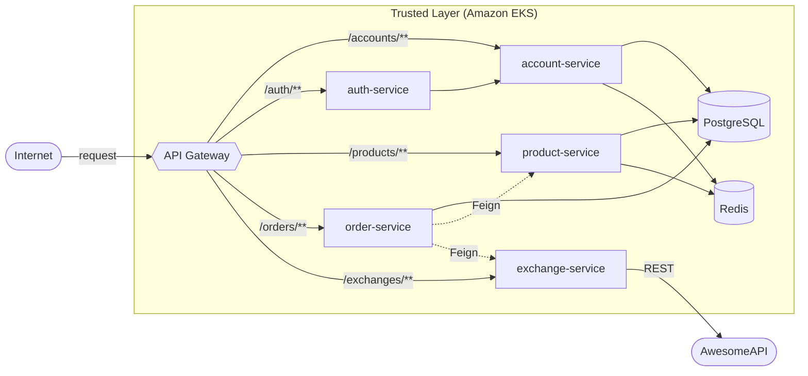
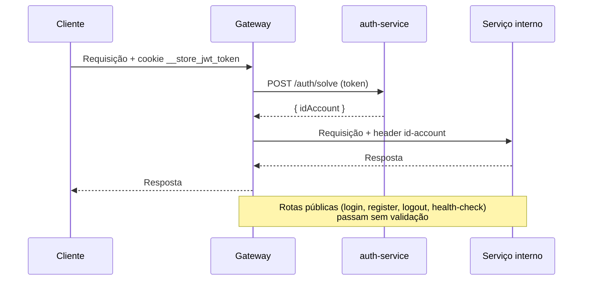
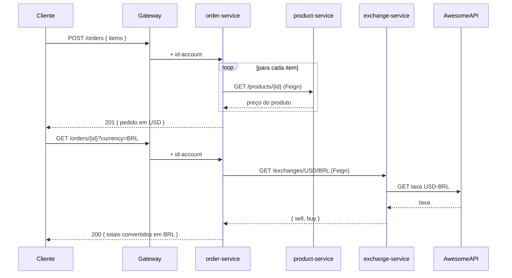

# Arquitetura

## Visão geral

> A plataforma segue o padrão **API Gateway + Trusted Layer**. Todo tráfego externo passa
> pelo gateway, que valida o JWT antes de encaminhar para os serviços internos. Apenas o
> gateway é exposto à internet; os demais serviços só são acessíveis dentro do cluster.

A autenticação é resolvida **uma vez** no gateway: o token é validado junto ao `auth-service`
e o identificador da conta é injetado como header `id-account` nas requisições downstream.
Os serviços internos confiam nesse header e não revalidam o JWT.

---

## Fluxo de autenticação

---

## Fluxo de criação de pedido com câmbio

!!! info "Snapshot de preço"
    O preço usado no pedido é gravado em USD **no momento da criação** (snapshot imutável).
    A conversão de moeda só acontece sob demanda, na leitura. Veja
    [Bottlenecks](bottlenecks.md).

---

## Stack técnica

| Serviço | Linguagem | Framework | Dados |
|---|---|---|---|
| gateway-service | Java 25 | Spring Cloud Gateway | — |
| auth-service | Java 25 | Spring Boot 4.0.3 | — (valida via account) |
| account-service | Java 25 | Spring Boot 4.0.3 | PostgreSQL + Redis |
| product-service | Java 25 | Spring Boot 4.0.3 | PostgreSQL + Redis |
| order-service | Java 25 | Spring Boot 4.0.3 | PostgreSQL |
| exchange-service | Python 3.12 | FastAPI | — (AwesomeAPI) |

---

## Infraestrutura

- **Orquestração:** Amazon EKS (Kubernetes gerenciado) — veja [EKS](infra/eks.md).
- **CI/CD:** Jenkins, um `Jenkinsfile` por serviço — veja [CI/CD](infra/cicd.md).
- **Dados:** PostgreSQL e Redis em-cluster (ClusterIP).
- **Observabilidade:** Spring Boot Actuator + Micrometer → Prometheus → Grafana.
- **Escala:** Horizontal Pod Autoscaler (HPA) no gateway — veja [Testes de Carga](testes-de-carga.md).
- **Custos e modelo de nuvem:** [Custos & SLA](custos.md) · [PaaS](paas.md).
