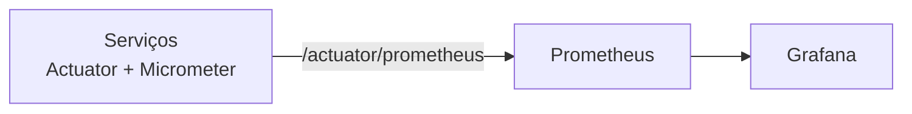
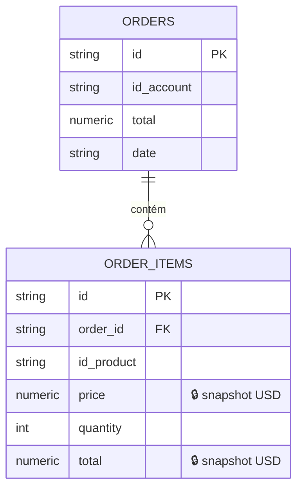
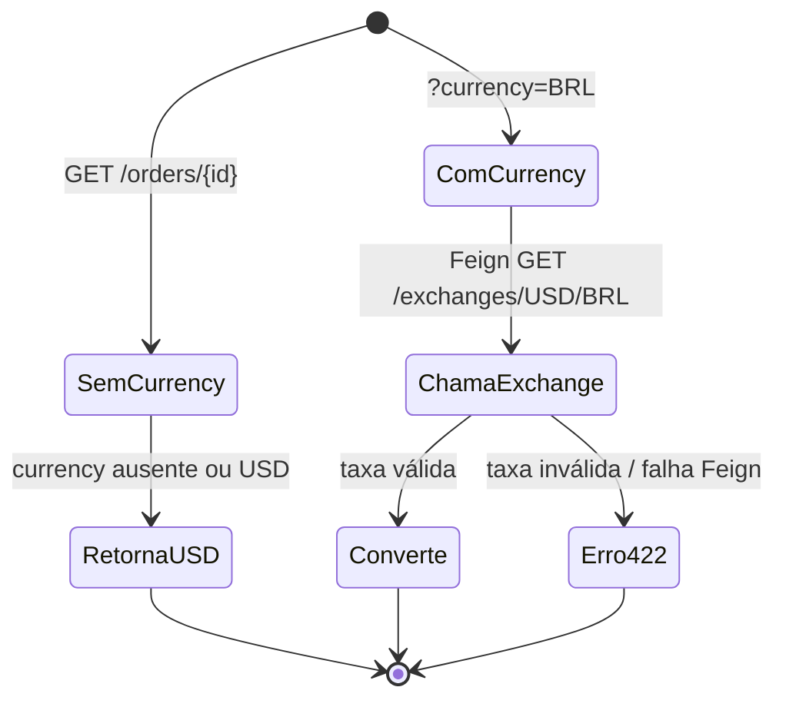
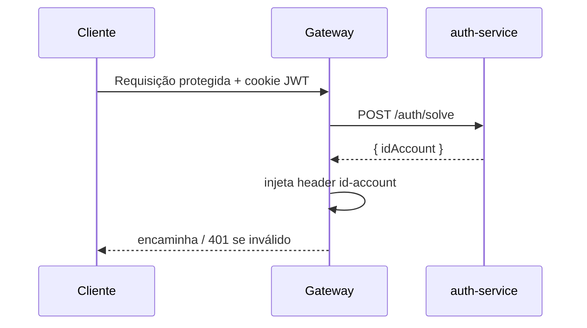

# Bottlenecks

Esta seção documenta os gargalos identificados na plataforma e as soluções implementadas.
São **6 bottlenecks** no total — dois deles são entregas **individuais** (Mateus Porto).

| # | Bottleneck | Solução | Responsável |
|---|---|---|---|
| 1 | Latência em leituras repetidas | Redis Cache (account + product) | Grupo |
| 2 | Falta de visibilidade em produção | Prometheus + Grafana | Grupo |
| 3 | Ponto único de falha no gateway | Nginx (local) + HPA (1–10 pods) | Grupo |
| 4 | Consistência histórica de preço | Snapshot imutável de `price` em USD | **Mateus Porto** |
| 5 | Acoplamento e custo de manter taxas | Conversão de moeda **on-demand** via OpenFeign | **Mateus Porto** |
| 6 | Acesso não autenticado | JWT (auth-service) + filtro no gateway | Grupo |

---

## 1. Caching com Redis

!!! abstract "Problema"
    Toda leitura de `account` e `product` ia ao PostgreSQL, mesmo para dados que mudam pouco.

**Solução:** Spring Cache + **Redis 7**. As operações de escrita atualizam/invalidam o cache,
e as leituras passam a ser servidas da memória.

| Anotação | Operação | Efeito |
|---|---|---|
| `@Cacheable` | leitura | retorna do cache; em *miss*, consulta o banco e popula |
| `@CachePut` | criação/atualização | grava no banco e atualiza o cache |
| `@CacheEvict` | remoção | remove a entrada do cache |

| Métrica | Sem cache | Com cache (hit) |
|---|---|---|
| Latência de leitura | ~50 ms | ~1 ms |
| Carga no PostgreSQL | alta | reduzida (~98%) |

!!! warning "Serialização"
    Os DTOs usam `record` + acessores fluentes (Lombok), então o `RedisConfig` configura um
    `ObjectMapper` com visibilidade de campo (`FIELD = ANY`) e `GenericJackson2JsonRedisSerializer`.
    Sem isso, a (de)serialização do cache falha. Detalhes em [Product API](servicos/product.md).

---

## 2. Observabilidade com Prometheus + Grafana

!!! abstract "Problema"
    Não havia métricas para detectar saturação, latência ou comportamento sob carga.

**Solução:** Actuator + Micrometer expõem `/{serviço}/actuator/prometheus`; o Prometheus
faz *scrape* e o Grafana visualiza.



```yaml title="prometheus.yml (trecho)"
scrape_configs:
  - job_name: gateway
    metrics_path: /gateway/actuator/prometheus
    static_configs: [{ targets: ['gateway:8080'] }]
  - job_name: product
    metrics_path: /products/actuator/prometheus
    static_configs: [{ targets: ['product:8080'] }]
  - job_name: order
    metrics_path: /orders/actuator/prometheus
    static_configs: [{ targets: ['order:8080'] }]
```

!!! tip "Dashboard"
    Importamos o dashboard **JVM (Micrometer)** (ID `4701`) no Grafana para visão de heap,
    GC, threads e throughput HTTP.

---

## 3. Load Balancing com Nginx e HPA

!!! abstract "Problema"
    Um único gateway é um **Single Point of Failure** e não absorve picos de tráfego.

**Local (Docker Compose):** Nginx como reverse proxy distribuindo entre **3 réplicas** do gateway.

**Produção (EKS):** **Horizontal Pod Autoscaler** escala o gateway de **1 a 10 réplicas** com
alvo de **50% de CPU**.

```yaml title="hpa.yaml (trecho)"
apiVersion: autoscaling/v2
kind: HorizontalPodAutoscaler
spec:
  scaleTargetRef: { apiVersion: apps/v1, kind: Deployment, name: gateway }
  minReplicas: 1
  maxReplicas: 10
  metrics:
    - type: Resource
      resource: { name: cpu, target: { type: Utilization, averageUtilization: 50 } }
```

!!! info "Cooldown"
    O HPA tem janela de estabilização (~5 min) ao reduzir réplicas, evitando *flapping*.
    O comportamento sob carga está em [Testes de Carga](testes-de-carga.md).

---

## 4. Snapshot imutável de preço — *individual: Mateus Porto*

!!! abstract "Problema"
    Se o pedido referenciasse o preço atual do produto, **alterações futuras de preço
    reescreveriam o histórico** — um pedido de ontem mudaria de valor hoje.

**Solução:** no momento da criação, o `order-service` busca o preço via Feign e grava um
**snapshot** de `price` e `total` (em USD) em `order_items`. O pedido passa a ser
**imutável** em relação a mudanças posteriores de preço.



```java title="OrderService.create() — snapshot"
ProductOut product = productController.findById(itemIn.idProduct()).getBody(); // (1)!
BigDecimal total = product.price().multiply(BigDecimal.valueOf(itemIn.quantity()));
return OrderItem.builder()
    .idProduct(itemIn.idProduct())
    .price(product.price())   // (2)!
    .quantity(itemIn.quantity())
    .total(total)
    .build();
```

1. Preço obtido do `product-service` via OpenFeign; `FeignException` → `400 Bad Request` (produto inexistente).
2. O preço é **congelado** no item — leituras futuras não reconsultam o `product-service`.

| Aspecto | Sem snapshot | Com snapshot |
|---|---|---|
| Integridade histórica | ❌ quebra ao mudar preço | ✅ imutável |
| Leitura do pedido | depende do product-service | independente |

---

## 5. Conversão de moeda on-demand via OpenFeign — *individual: Mateus Porto*

!!! abstract "Problema"
    Onde armazenar conversões de moeda? Guardar todos os pedidos em N moedas explode o
    armazenamento e fica desatualizado; converter no frontend espalha regra de negócio.

**Solução:** valores são armazenados **só em USD**; a conversão acontece **sob demanda**,
quando o cliente passa `?currency=` em `GET /orders/{id}`. O `order-service` chama o
`exchange-service` via Feign e multiplica os totais pela taxa.



```java title="OrderService.resolveRate()"
public BigDecimal resolveRate(String currency, String idAccount) {
    if (currency == null || currency.equalsIgnoreCase(BASE_CURRENCY)) {
        return null; // (1)!
    }
    try {
        ExchangeOut rate = exchangeController
            .getRate(BASE_CURRENCY, currency.toUpperCase(), idAccount).getBody();
        if (rate == null || rate.sell() == null) {
            throw new ResponseStatusException(HttpStatus.UNPROCESSABLE_ENTITY, ...);
        }
        return BigDecimal.valueOf(rate.sell());
    } catch (FeignException e) {
        throw new ResponseStatusException(HttpStatus.UNPROCESSABLE_ENTITY, ...); // (2)!
    }
}
```

1. USD é a moeda base — *short-circuit*, sem chamada externa.
2. Moeda não suportada ou falha do `exchange-service` → `422 Unprocessable Entity`.

!!! warning "Escopo do Feign"
    `@EnableFeignClients(basePackages = { "store.product", "store.exchange" })` restringe o
    scan aos clientes realmente usados, evitando que a interface MVC do próprio `order` seja
    interpretada como cliente Feign.

| Aspecto | Armazenar N moedas | On-demand (escolhido) |
|---|---|---|
| Armazenamento | cresce por moeda | só USD |
| Atualização da taxa | obsoleta no banco | sempre atual |
| Acoplamento | alto | isolado no exchange-service |

---

## 6. Autenticação com JWT

!!! abstract "Problema"
    Sem autenticação, qualquer requisição alcançaria os serviços internos.

**Solução:** o `auth-service` emite o JWT; o **gateway** valida em cada requisição e injeta
`id-account` downstream. Rotas públicas (login, register, logout, health-check) são isentas.



```java title="RouterValidator — rotas públicas"
private List<String> openApiEndpoints = List.of(
    "POST /auth/register",
    "GET /auth/logout",
    "POST /auth/login",
    "GET /health-check"
);
```

- **Isolamento:** serviços internos confiam no `id-account` e não revalidam o token.
- **Overhead:** validação no gateway, < 1 ms por requisição.
- **Rotas públicas:** isentas pela `RouterValidator`.
