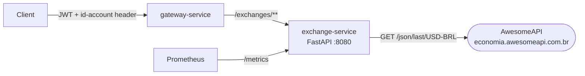

# Exchange API

!!! abstract "Sobre"
    Serviço de cotação de câmbio implementado em **Python 3 + FastAPI**, integrando com a [AwesomeAPI](https://docs.awesomeapi.com.br/) para obter taxas em tempo real. Expõe métricas ao Prometheus via `prometheus-fastapi-instrumentator`.

---

## Arquitetura



### Diferencial

Ao contrário dos serviços Java, o `exchange-service` é implementado em **Python** com FastAPI — framework assíncrono de alta performance. Isso demonstra que a plataforma é **poliglota**: cada serviço pode usar a tecnologia mais adequada ao seu domínio.

---

## Endpoints

| Método | Rota | Auth | Descrição | Retorno |
|---|---|---|---|---|
| `GET` | `/exchanges/{from}/{to}` | ✅ | Cotação entre duas moedas | `200 OK` |
| `GET` | `/exchanges/health-check` | ❌ | Health check público | `200 OK` |
| `GET` | `/metrics` | ❌ | Métricas Prometheus | `200 OK` |

### Pares de Moedas Suportados

| Par | Exemplo |
|---|---|
| USD → BRL | `GET /exchanges/USD/BRL` |
| EUR → BRL | `GET /exchanges/EUR/BRL` |
| USD → EUR | `GET /exchanges/USD/EUR` |
| GBP → USD | `GET /exchanges/GBP/USD` |
| BRL → USD | `GET /exchanges/BRL/USD` |

---

## Implementação

### Estrutura do Projeto

```
exchange-service/
├── main.py       # FastAPI app + Prometheus instrumentation
├── router.py     # Endpoints REST
├── service.py    # Lógica de negócio + integração AwesomeAPI
├── model.py      # Pydantic models (request/response)
├── Dockerfile
└── k8s/
    ├── deployment.yaml
    └── service.yaml
```

### `main.py` — Aplicação

```python title="main.py"
from fastapi import FastAPI
from router import router
from prometheus_fastapi_instrumentator import Instrumentator

app = FastAPI()
app.include_router(router)

Instrumentator().instrument(app).expose(app) # (1)!
```

1. `Instrumentator` adiciona automaticamente o endpoint `/metrics` com métricas de latência, throughput e status HTTP de todas as rotas.

### `model.py` — Modelos Pydantic

```python title="model.py"
from pydantic import BaseModel, ConfigDict, Field

class ExchangeOut(BaseModel):
    model_config = ConfigDict(
        populate_by_name=True,
        serialize_by_alias=True  # (1)!
    )

    sell: float
    buy: float
    date: str
    id_account: str = Field(serialization_alias="id-account") # (2)!
```

1. `serialize_by_alias=True` garante que o JSON de resposta use o alias `id-account` ao invés de `id_account`.
2. Python não permite hífens em nomes de atributos. O `Field` com `serialization_alias` resolve isso: internamente é `id_account`, na resposta JSON é `"id-account"`.

### `router.py` — Endpoints

```python title="router.py"
from fastapi import APIRouter, Header
from model import ExchangeOut
from service import get_exchange

router = APIRouter()

@router.get("/exchanges/health-check", status_code=200) # (1)!
def health_check():
    return None

@router.get("/exchanges/{from_currency}/{to_currency}", response_model=ExchangeOut)
def exchange(
    from_currency: str,
    to_currency: str,
    id_account: str = Header(alias="id-account"), # (2)!
):
    return get_exchange(from_currency, to_currency, id_account)
```

1. Rota pública sem autenticação — necessária para o load test e Kubernetes liveness probe.
2. O gateway passa o `id-account` como header após validar o JWT. O FastAPI lê o header e injeta como parâmetro.

!!! warning "Ordem das rotas importa"
    A rota `/exchanges/health-check` deve ser declarada **antes** de `/exchanges/{from_currency}/{to_currency}`. Caso contrário, o FastAPI interpretaria `health-check` como valor do parâmetro `from_currency`.

### `service.py` — Integração AwesomeAPI

```python title="service.py"
import requests
from fastapi import HTTPException
from model import ExchangeOut

def get_exchange(from_currency: str, to_currency: str, id_account: str) -> ExchangeOut:
    from_upper = from_currency.upper()
    to_upper   = to_currency.upper()
    key        = f"{from_upper}{to_upper}"
    url        = f"https://economia.awesomeapi.com.br/json/last/{from_upper}-{to_upper}"

    try:
        response = requests.get(url, timeout=5) # (1)!
        response.raise_for_status()
        data = response.json()[key]

        return ExchangeOut(
            sell=float(data["ask"]),   # (2)!
            buy=float(data["bid"]),    # (3)!
            date=data["create_date"],
            id_account=id_account,
        )
    except (requests.RequestException, KeyError, ValueError) as e:
        raise HTTPException(status_code=502, detail=f"Exchange API error: {str(e)}") # (4)!
```

1. Timeout de 5s para não bloquear o serviço caso a AwesomeAPI esteja lenta.
2. `ask` — preço de venda da moeda (o mercado vende para você).
3. `bid` — preço de compra (o mercado compra de você).
4. `502 Bad Gateway` — erro semântico correto: o serviço está funcionando, mas a API externa falhou.

---

## Resposta da API

Exemplo: `GET /exchanges/USD/BRL`

```json
{
  "sell": 5.8742,
  "buy": 5.8718,
  "date": "2025-05-13 20:15:00",
  "id-account": "0195ae95-5be7-7dd3-b35d-7a7d87c404fb"
}
```

---

## Observabilidade

O `prometheus-fastapi-instrumentator` expõe o endpoint `/metrics` automaticamente com as métricas:

```
http_requests_total{method="GET",handler="/exchanges/{from_currency}/{to_currency}",status="2xx"} 1234
http_request_duration_seconds_bucket{...} ...
```

Configuração no Prometheus:

```yaml title="prometheus-service/k8s/configmap.yaml"
- job_name: ExchangeMetrics
  metrics_path: /metrics          # (1)!
  static_configs:
    - targets: ['exchange-service:8080']
```

1. Diferente dos serviços Java que usam `/actuator/prometheus`, o FastAPI expõe em `/metrics` por padrão.

---

## Rota no Gateway

```yaml title="gateway-service/src/main/resources/application.yaml"
routes:
  - id: exchanges
    uri: http://exchange-service:8080
    predicates:
      - Path=/exchanges/**
```

---

## Deploy no EKS

```yaml title="exchange-service/k8s/deployment.yaml"
containers:
  - name: exchange-service
    image: feijonts/exchange-service:latest
    ports:
      - containerPort: 8080
    resources:
      requests:
        memory: "128Mi"
        cpu: "125m"
      limits:
        memory: "256Mi"
        cpu: "250m"
```

---

## Exemplo de Uso

```bash
# Autenticar
TOKEN=$(curl -s -X POST http://<ELB>:8080/auth/login \
  -H "Content-Type: application/json" \
  -d '{"email":"user@test.com","password":"123"}' | jq -r '.token')

# Buscar cotação USD → BRL
curl http://<ELB>:8080/exchanges/USD/BRL \
  -H "Authorization: Bearer $TOKEN"

# Resposta
{
  "sell": 5.8742,
  "buy": 5.8718,
  "date": "2025-05-13 20:15:00",
  "id-account": "..."
}
```
