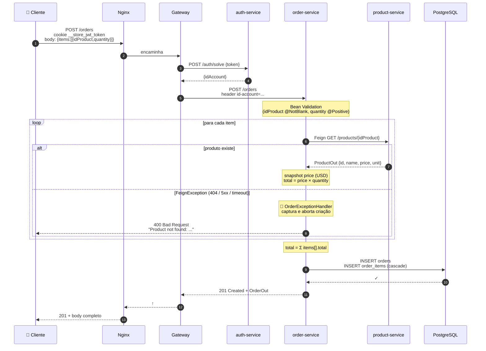
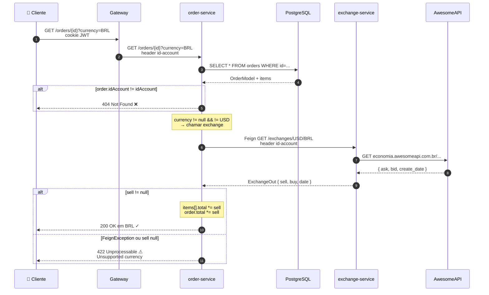
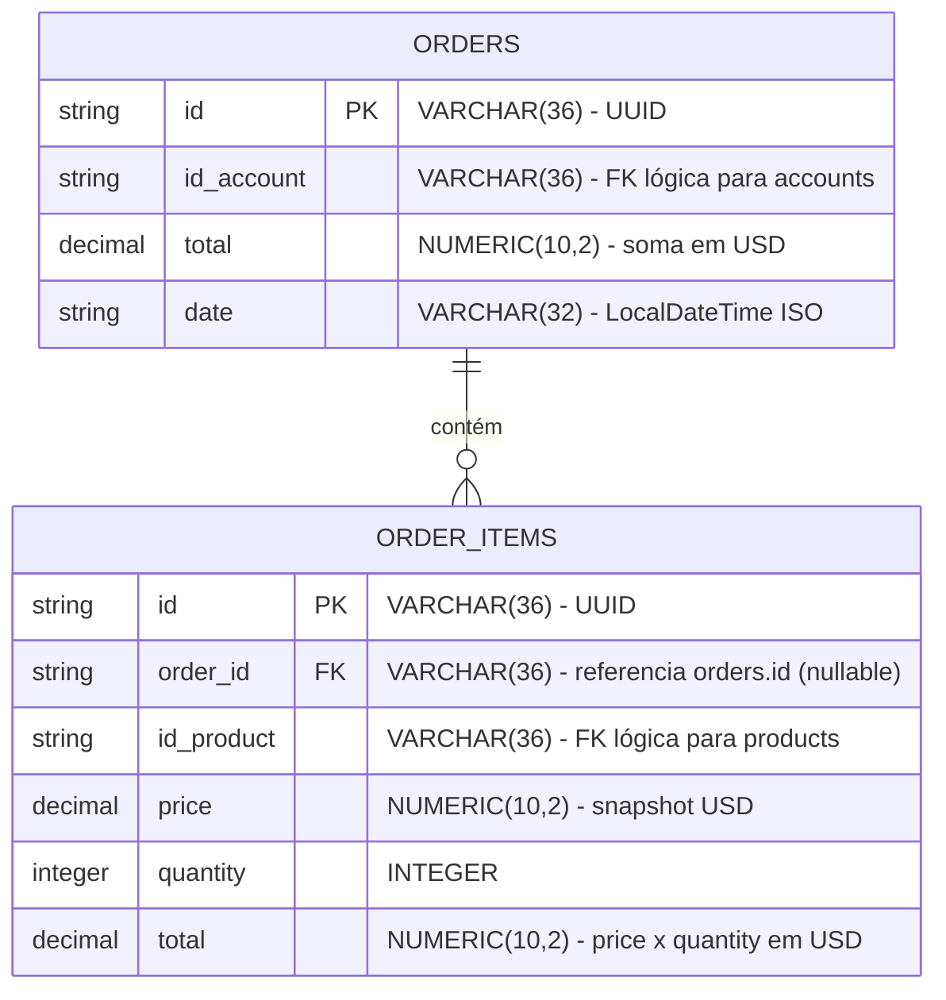
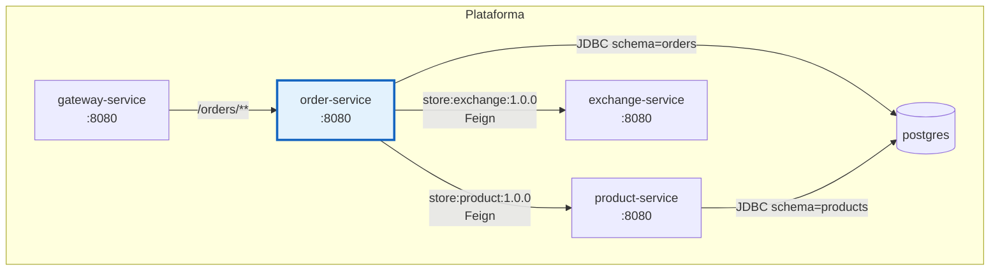
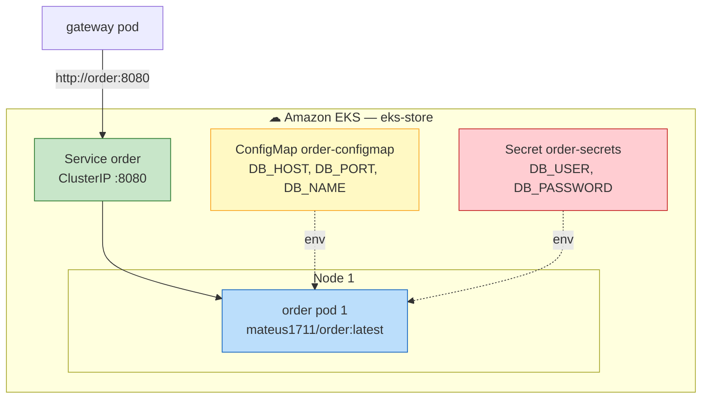
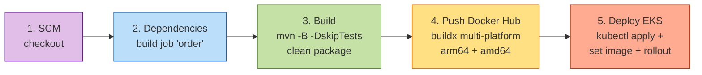

# Order API

!!! abstract "Sobre"
    API REST para gerenciamento de pedidos, implementada em **Spring Boot 4.0.3** com Java 25. Persiste em PostgreSQL (schema `orders`), resolve preço/produto via **OpenFeign** no `product-service` na criação, e converte valores opcionalmente via **OpenFeign** no `exchange-service` na leitura.

---

## Visão Geral da Arquitetura

```mermaid
flowchart TB
    Client(["👤 Cliente<br/>cookie __store_jwt_token"])

    subgraph Gateway["🚪 Gateway Layer"]
        NGINX[Nginx :80]
        GW[gateway-service<br/>Spring Cloud Gateway]
        AUTH_FILTER{{AuthorizationFilter<br/>valida JWT}}
    end

    subgraph OrderSvc["📦 order-service :8080"]
        RES[OrderResource<br/>REST controller]
        SVC[OrderService<br/>business logic]
        REPO[OrderRepository<br/>Spring Data JPA]
        EXH[OrderExceptionHandler<br/>RestControllerAdvice]
    end

    subgraph Externals["🔌 Serviços externos"]
        PROD[(product-service<br/>via Feign)]
        EX[(exchange-service<br/>via Feign)]
        DB[("PostgreSQL<br/>schema=orders")]
    end

    Client -->|HTTPS :80| NGINX
    NGINX -->|:8080| GW
    GW --> AUTH_FILTER
    AUTH_FILTER -->|injeta id-account header| RES
    RES --> SVC
    SVC --> REPO
    REPO --> DB
    SVC -.->|GET /products/&#123;id&#125;| PROD
    SVC -.->|GET /exchanges/USD/&#123;to&#125;| EX
    EXH -.->|400/404/422| RES

    style OrderSvc fill:#e1f5ff,stroke:#0288d1,stroke-width:2px
    style Externals fill:#fff3e0,stroke:#f57c00
    style Client fill:#f3e5f5,stroke:#7b1fa2
    style Gateway fill:#e8f5e9,stroke:#388e3c
```



### Módulos

| Módulo | Tipo | Conteúdo |
|---|---|---|
| `order` | 📚 Biblioteca Maven (`store:order:1.0.0`) | `@FeignClient` + 6 DTOs (`OrderIn`, `OrderOut`, `OrderItemIn`, `OrderItemOut`, `OrderProductRef`, `OrderSummaryOut`) + Bean Validation |
| `order-service` | 🚀 Microsserviço Spring Boot | REST + JPA + Flyway + 2 clientes Feign (`product` + `exchange`) + ExceptionHandler |

---

## Endpoints

| Método | Rota | Auth | Body | Status esperados |
|---|---|---|---|---|
| `POST` | `/orders` | ✅ | `OrderIn` | `201` / `400` |
| `GET` | `/orders` | ✅ | — | `200` (lista resumo: `id`, `date`, `total`) |
| `GET` | `/orders/{id}` | ✅ | — | `200` / `404` |

!!! tip "Query param `currency` (opcional no GET /orders/{id})"
    Passe `?currency=BRL` (ou outra moeda suportada pelo `exchange-service`) para receber `items[].total` e `total` convertidos. Sem o param ou com `currency=USD` → sem chamada ao exchange (zero overhead). Moeda inválida → `422 Unprocessable Entity`.

### Decisão de status code

```mermaid
flowchart TD
    Req[Request recebido] --> Auth{cookie JWT<br/>válido?}
    Auth -->|não| R401[401 Unauthorized<br/>do gateway]
    Auth -->|sim| Bean{Bean Validation<br/>passou?}
    Bean -->|não| R400V[400 Bad Request<br/>+ lista de erros]
    Bean -->|sim| Op{Qual operação?}

    Op -->|POST /orders| Prod{Produto existe?}
    Prod -->|sim| Save[Persiste + retorna 201]
    Prod -->|não / Feign erro| R400P[400 Bad Request<br/>Product not found]

    Op -->|GET /orders/&#123;id&#125;| Own{Pertence ao<br/>id-account?}
    Own -->|não / não existe| R404[404 Not Found]
    Own -->|sim| Curr{currency != null<br/>e != USD?}
    Curr -->|não| R200USD[200 OK em USD]
    Curr -->|sim| Ex{Exchange respondeu<br/>com taxa válida?}
    Ex -->|sim| R200Conv[200 OK com valores<br/>convertidos]
    Ex -->|não| R422[422 Unprocessable<br/>Unsupported currency]

    style R200USD fill:#c8e6c9,stroke:#2e7d32
    style R200Conv fill:#c8e6c9,stroke:#2e7d32
    style Save fill:#c8e6c9,stroke:#2e7d32
    style R400V fill:#ffccbc,stroke:#d84315
    style R400P fill:#ffccbc,stroke:#d84315
    style R401 fill:#ffccbc,stroke:#d84315
    style R404 fill:#ffccbc,stroke:#d84315
    style R422 fill:#ffe0b2,stroke:#ef6c00
```



---

## Sequence — POST `/orders`



---

## Sequence — GET `/orders/{id}?currency=BRL`



---

## Modelo de Dados



!!! info "`order_id` é nullable na DDL?"
    Sim — propositalmente. Hibernate insere o item antes de atualizar a FK quando o relacionamento é `@OneToMany` unidirecional com `@JoinColumn`. A coluna nullable permite o insert; a constraint FK garante integridade após o commit.

---

## DTOs (biblioteca `order`)

=== "OrderItemIn"

    ```java title="order/src/main/java/store/order/OrderItemIn.java"
    @Builder
    public record OrderItemIn(

        @NotBlank
        String idProduct,

        @NotNull @Positive
        Integer quantity

    ) {}
    ```

=== "OrderIn"

    ```java title="order/src/main/java/store/order/OrderIn.java"
    @Builder
    public record OrderIn(

        @NotEmpty @Valid
        List<OrderItemIn> items

    ) {}
    ```

=== "OrderProductRef"

    ```java title="order/src/main/java/store/order/OrderProductRef.java"
    @Builder
    public record OrderProductRef(
        String id
    ) {}
    ```

=== "OrderItemOut"

    ```java title="order/src/main/java/store/order/OrderItemOut.java"
    @Builder
    public record OrderItemOut(
        String id,
        OrderProductRef product, // (1)!
        Integer quantity,
        BigDecimal total
    ) {}
    ```

    1. Produto vem **aninhado** como `{ "product": { "id": "..." } }` — segue a spec da aula.

=== "OrderOut"

    ```java title="order/src/main/java/store/order/OrderOut.java"
    @Builder
    public record OrderOut(
        String id,
        String date,
        String currency, // (1)!
        List<OrderItemOut> items,
        BigDecimal total
    ) {}
    ```

    1. Default `"USD"`. Reflete a moeda solicitada via `?currency=`.

=== "OrderSummaryOut"

    ```java title="order/src/main/java/store/order/OrderSummaryOut.java"
    @Builder
    public record OrderSummaryOut(
        String id,
        String date,
        BigDecimal total
    ) {}
    ```

=== "OrderController (Feign)"

    ```java title="order/src/main/java/store/order/OrderController.java"
    @FeignClient(name = "order", url = "http://order:8080")
    public interface OrderController {

        @PostMapping("/orders")
        ResponseEntity<OrderOut> create(
            @RequestBody @Valid OrderIn in,
            @RequestHeader("id-account") String idAccount
        );

        @GetMapping("/orders/{id}")
        ResponseEntity<OrderOut> findById(
            @PathVariable String id,
            @RequestParam(value = "currency", required = false) String currency,
            @RequestHeader("id-account") String idAccount
        );

        @GetMapping("/orders")
        ResponseEntity<List<OrderSummaryOut>> findByAccount(
            @RequestHeader("id-account") String idAccount
        );
    }
    ```

---

## Camadas internas do `order-service`

```mermaid
flowchart TD
    subgraph HTTP["🌐 HTTP layer"]
        Resource[OrderResource<br/>@RestController<br/>implements OrderController]
    end
    subgraph Business["⚙ Business layer"]
        Service[OrderService<br/>@Service]
        Parser[OrderParser<br/>static utility]
    end
    subgraph Persistence["💾 Persistence layer"]
        Repo[OrderRepository<br/>extends CrudRepository]
        Model[OrderModel + OrderItemModel<br/>@Entity]
    end
    subgraph Infra["🔌 Infrastructure"]
        FC1[ProductController<br/>Feign client]
        FC2[ExchangeController<br/>Feign client]
        DB[(PostgreSQL)]
    end
    subgraph CrossCutting["✂ Cross-cutting"]
        Cross[OrderExceptionHandler<br/>@RestControllerAdvice]
    end

    Resource --> Service
    Resource --> Parser
    Service --> Repo
    Service --> FC1
    Service --> FC2
    Repo --> Model
    Model --> DB
    Cross -.->|intercepta exceções de| Resource

    style Resource fill:#bbdefb,stroke:#1976d2
    style Service fill:#c5cae9,stroke:#3949ab
    style Parser fill:#c5cae9,stroke:#3949ab
    style Repo fill:#d1c4e9,stroke:#5e35b1
    style Model fill:#d1c4e9,stroke:#5e35b1
    style FC1 fill:#ffe0b2,stroke:#f57c00
    style FC2 fill:#ffe0b2,stroke:#f57c00
    style DB fill:#ffe0b2,stroke:#f57c00
    style Cross fill:#ffcdd2,stroke:#c62828
    style CrossCutting fill:#fce4ec,stroke:#ad1457,stroke-dasharray: 5 5
```

---

## Service — coração da lógica

```java title="order-service/.../OrderService.java"
@Service
public class OrderService {

    private static final String BASE_CURRENCY = "USD";

    @Autowired private OrderRepository orderRepository;
    @Autowired private ProductController productController;   // Feign → product-service
    @Autowired private ExchangeController exchangeController; // Feign → exchange-service

    public Order create(OrderIn in, String idAccount) {
        List<OrderItem> items = in.items().stream().map(itemIn -> {
            ProductOut product;
            try {
                product = productController.findById(itemIn.idProduct()).getBody();
            } catch (FeignException e) { // (1)!
                throw new ResponseStatusException(HttpStatus.BAD_REQUEST,
                    "Product not found: " + itemIn.idProduct());
            }
            if (product == null) {
                throw new ResponseStatusException(HttpStatus.BAD_REQUEST,
                    "Product not found: " + itemIn.idProduct());
            }
            BigDecimal total = product.price()
                .multiply(BigDecimal.valueOf(itemIn.quantity()));
            return OrderItem.builder()
                .idProduct(itemIn.idProduct())
                .price(product.price())  // (2)!
                .quantity(itemIn.quantity())
                .total(total)
                .build();
        }).toList();

        BigDecimal total = items.stream()
            .map(OrderItem::total)
            .reduce(BigDecimal.ZERO, BigDecimal::add);

        Order order = Order.builder()
            .idAccount(idAccount)
            .items(items)
            .total(total)
            .date(LocalDateTime.now().toString())
            .build();
        return orderRepository.save(new OrderModel(order)).to();
    }

    public Order findByIdAndAccount(String id, String idAccount) {
        Order o = orderRepository.findById(id).map(OrderModel::to).orElse(null);
        if (o == null || !o.idAccount().equals(idAccount)) {
            throw new ResponseStatusException(HttpStatus.NOT_FOUND); // (3)!
        }
        return o;
    }

    public BigDecimal resolveRate(String currency, String idAccount) {
        if (currency == null || currency.equalsIgnoreCase(BASE_CURRENCY)) {
            return null; // (4)!
        }
        try {
            ExchangeOut rate = exchangeController
                .getRate(BASE_CURRENCY, currency.toUpperCase(), idAccount).getBody();
            if (rate == null || rate.sell() == null) {
                throw new ResponseStatusException(HttpStatus.UNPROCESSABLE_ENTITY,
                    "Unsupported currency: " + currency);
            }
            return BigDecimal.valueOf(rate.sell());
        } catch (FeignException e) {
            throw new ResponseStatusException(HttpStatus.UNPROCESSABLE_ENTITY,
                "Unsupported currency: " + currency);
        }
    }
}
```

1. **Defensivo**: qualquer falha do `product-service` (404, 500, timeout) vira `400` — bug externo não derruba o `order-service`.
2. **Snapshot** de `price` (USD) — ver [bottleneck individual #4](../projeto/bottlenecks.md#4-snapshot-imutavel-de-preco-order-service-individual-mateus-porto).
3. **Ownership**: pedido inexistente e pedido de outro user retornam mesmo `404` — não vaza existência.
4. **Short-circuit currency**: USD ou null → nem chama o exchange. Ver [bottleneck individual #5](../projeto/bottlenecks.md#5-conversao-de-moeda-sob-demanda-via-openfeign-order-service-individual-mateus-porto).

---

## Application — escopo do Feign

```java title="order-service/.../OrderApplication.java"
@SpringBootApplication
@EnableFeignClients(basePackages = { "store.product", "store.exchange" }) // (1)!
public class OrderApplication {
    public static void main(String[] args) {
        SpringApplication.run(OrderApplication.class, args);
    }
}
```

1. `basePackages` é **explícito** — não escaneia `store.order` porque a interface `OrderController` tem `@FeignClient` E é implementada localmente por `OrderResource`. Spring criaria dois beans concorrentes e o boot quebraria.

---

## Tratamento centralizado de erros

```java title="order-service/.../OrderExceptionHandler.java"
@RestControllerAdvice
public class OrderExceptionHandler {

    @ExceptionHandler(ResponseStatusException.class)
    public ResponseEntity<Map<String, Object>> handleStatus(ResponseStatusException ex) {
        Map<String, Object> body = new HashMap<>();
        body.put("status", ex.getStatusCode().value());
        body.put("message", ex.getReason());
        return ResponseEntity.status(ex.getStatusCode()).body(body);
    }

    @ExceptionHandler(MethodArgumentNotValidException.class)
    public ResponseEntity<Map<String, Object>> handleValidation(MethodArgumentNotValidException ex) {
        Map<String, Object> body = new HashMap<>();
        body.put("status", HttpStatus.BAD_REQUEST.value());
        body.put("message", "Invalid request payload");
        body.put("errors", ex.getBindingResult().getFieldErrors().stream()
            .map(f -> f.getField() + ": " + f.getDefaultMessage()).toList());
        return ResponseEntity.badRequest().body(body);
    }
}
```

---

## Migrations Flyway

```sql title="V2026.05.13.001__create_schema.sql"
CREATE SCHEMA IF NOT EXISTS orders;
```

```sql title="V2026.05.13.002__create_tables.sql"
CREATE TABLE orders.orders (
    id         VARCHAR(36)    NOT NULL PRIMARY KEY,
    id_account VARCHAR(36)    NOT NULL,
    total      NUMERIC(10, 2) NOT NULL,
    date       VARCHAR(32)    NOT NULL
);

CREATE TABLE orders.order_items (
    id         VARCHAR(36)    NOT NULL PRIMARY KEY,
    order_id   VARCHAR(36)    REFERENCES orders.orders(id),
    id_product VARCHAR(36)    NOT NULL,
    price      NUMERIC(10, 2) NOT NULL,
    quantity   INTEGER        NOT NULL,
    total      NUMERIC(10, 2) NOT NULL
);

CREATE INDEX idx_orders_id_account ON orders.orders(id_account);
CREATE INDEX idx_order_items_order_id ON orders.order_items(order_id);
```

---

## Integração com o resto da plataforma



### Rota no Gateway

```yaml title="gateway-service/src/main/resources/application.yaml"
routes:
  - id: orders
    uri: http://order:8080
    predicates:
      - Path=/orders/**
```

---

## Deploy

### Local — Docker Compose

```yaml title="api/compose.yml"
order:
  build:
    context: ./order-service
    dockerfile: Dockerfile
  hostname: order
  environment:
    DATABASE_HOST: db
    DATABASE_PORT: 5432
    DATABASE_DB: ${DB_NAME:-store}
    DATABASE_USERNAME: ${DB_USER:-store}
    DATABASE_PASSWORD: ${DB_PASSWORD:-devpass}
  depends_on:
    - db
    - exchange-service
```

### Produção — AWS EKS



### Pipeline Jenkins — 5 stages



---

## Exemplos de Uso

```bash
# 1. Autenticar (cookie __store_jwt_token salvo em cookies.txt)
curl -s -c cookies.txt -X POST http://localhost:8080/auth/login \
  -H "Content-Type: application/json" \
  -d '{"username":"user@test.com","password":"123"}'

# 2. Criar pedido
curl -X POST http://localhost:8080/orders \
  -b cookies.txt \
  -H "Content-Type: application/json" \
  -d '{"items":[{"idProduct":"<uuid>","quantity":2}]}'
```

```json title="Response 201 Created"
{
  "id": "5c8c4565-2f4e-4f93-90a4-c5977d948646",
  "date": "2026-05-20T20:18:16.797",
  "currency": "USD",
  "items": [
    {
      "id": "40977ff0-4c84-426f-bc02-dcca1697174b",
      "product": { "id": "11111111-1111-1111-1111-111111111111" },
      "quantity": 3,
      "total": 30.00
    }
  ],
  "total": 30.00
}
```

```bash
# 3. Buscar pedido em USD (caminho padrão — sem chamada ao exchange)
curl -b cookies.txt http://localhost:8080/orders/5c8c4565-...
# → "currency":"USD", "total":30.00  (mesmo body do POST acima)

# 4. Mesmo pedido, convertido para BRL via exchange-service
curl -b cookies.txt "http://localhost:8080/orders/5c8c4565-...?currency=BRL"
```

```json title="Response BRL (taxa USD→BRL ~5.0167 no momento da consulta)"
{
  "id": "5c8c4565-2f4e-4f93-90a4-c5977d948646",
  "date": "2026-05-20T20:18:16.797",
  "currency": "BRL",
  "items": [
    {
      "id": "40977ff0-...",
      "product": { "id": "11111111-..." },
      "quantity": 3,
      "total": 150.501000
    }
  ],
  "total": 150.501000
}
```

```bash
# 5. Listar pedidos (resumo)
curl -b cookies.txt http://localhost:8080/orders
# → [ { "id": "...", "date": "...", "total": 30.00 } ]

# 6. Pedido de outro user → 404 (silent)
# 7. Produto inexistente no POST → 400
# 8. ?currency=ZZZ → 422
```

---

## Status do build

!!! success "Smoke test validado em 2026-05-20"
    Todos os 6 endpoints/cenários testados via `curl` num container `curlimages/curl` na rede Docker. POST → 201, GET USD → 200, GET BRL → 200 (com conversão), GET outro user → 404, POST produto inválido → 400, GET ZZZ → 422. ✅
