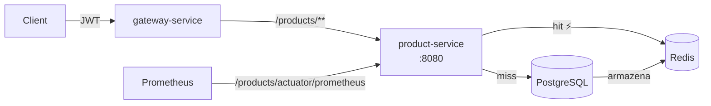

# Product API

!!! abstract "Sobre"
    API REST para gerenciamento de produtos, implementada em **Spring Boot 3** com persistência no PostgreSQL, cache no Redis e métricas expostas ao Prometheus.

---

## Arquitetura

O `product-service` é um microsserviço independente, consumido via gateway. A biblioteca `product` define as interfaces e DTOs compartilhados com outros serviços (ex: `order-service`).



### Módulos

| Módulo | Tipo | Descrição |
|---|---|---|
| `product` | Biblioteca Maven | Interface Feign Client + DTOs (`ProductIn`, `ProductOut`) |
| `product-service` | Serviço | Implementação REST, JPA, cache e métricas |

---

## Endpoints

| Método | Rota | Auth | Descrição | Retorno |
|---|---|---|---|---|
| `POST` | `/products` | ✅ | Cria um produto | `201 Created` + `Location` |
| `GET` | `/products` | ✅ | Lista todos os produtos | `200 OK` |
| `GET` | `/products/{id}` | ✅ | Busca produto por ID | `200 OK` / `404` |
| `DELETE` | `/products/{id}` | ✅ | Remove um produto | `204 No Content` |
| `GET` | `/products/health-check` | ❌ | Health check público | `200 OK` |

---

## Implementação

### DTOs (biblioteca `product`)

=== "ProductIn"

    ```java title="product/src/main/java/store/product/ProductIn.java"
    @Builder
    public record ProductIn(
        String name,
        BigDecimal price,
        String unit
    ) {}
    ```

=== "ProductOut"

    ```java title="product/src/main/java/store/product/ProductOut.java"
    @Builder
    public record ProductOut(
        String id,
        String name,
        BigDecimal price,
        String unit
    ) {}
    ```

=== "ProductController (Feign)"

    ```java title="product/src/main/java/store/product/ProductController.java"
    @FeignClient(name = "product", url = "http://product:8080")
    public interface ProductController {

        @PostMapping("/products")
        ResponseEntity<Void> create(@RequestBody ProductIn in);

        @GetMapping("/products")
        ResponseEntity<List<ProductOut>> findAll();

        @GetMapping("/products/{id}")
        ResponseEntity<ProductOut> findById(@PathVariable String id);

        @DeleteMapping("/products/{id}")
        ResponseEntity<Void> delete(@PathVariable String id);

        @GetMapping("/products/health-check")
        ResponseEntity<Void> healthCheck();
    }
    ```

### Domínio (`product-service`)

=== "Product"

    ```java title="product-service/.../Product.java"
    @Data
    @Builder
    @Accessors(chain = true, fluent = true) // (1)!
    public class Product {
        private String id;
        private String name;
        private BigDecimal price;
        private String unit;
    }
    ```

    1. `fluent = true` gera `p.id()` ao invés de `p.getId()`. Requer configuração especial do Jackson para serialização no Redis — ver seção Cache.

=== "ProductService"

    ```java title="product-service/.../ProductService.java"
    @Service
    public class ProductService {

        @Autowired
        private ProductRepository productRepository;

        @CachePut(value = "products", key = "#result.id()") // (1)!
        public Product create(Product product) {
            return productRepository.save(new ProductModel(product)).to();
        }

        @Cacheable(value = "products", key = "#id") // (2)!
        public Product findById(String id) {
            return productRepository.findById(id)
                .map(ProductModel::to).orElse(null);
        }

        @CacheEvict(value = "products", key = "#id") // (3)!
        public void delete(String id) {
            productRepository.deleteById(id);
        }

        public List<Product> findAll() {
            return StreamSupport.stream(
                productRepository.findAll().spliterator(), false
            ).map(ProductModel::to).toList();
        }
    }
    ```

    1. `@CachePut` — sempre executa e **grava** o resultado no cache `products` com a chave sendo o ID do produto criado.
    2. `@Cacheable` — retorna do cache se a chave existir; caso contrário busca no banco e armazena.
    3. `@CacheEvict` — **invalida** a entrada do cache ao deletar, evitando servir dados obsoletos.

=== "ProductResource"

    ```java title="product-service/.../ProductResource.java"
    @RestController
    public class ProductResource implements ProductController {

        @Autowired
        private ProductService productService;

        @Override
        public ResponseEntity<Void> create(ProductIn in) {
            final Product p = productService.create(ProductParser.to(in));
            return ResponseEntity.created(
                ServletUriComponentsBuilder
                    .fromCurrentRequest()
                    .path("/{id}")
                    .buildAndExpand(p.id())
                    .toUri()
            ).build(); // (1)!
        }

        @Override
        public ResponseEntity<ProductOut> findById(String id) {
            Product p = productService.findById(id);
            return p == null
                ? ResponseEntity.notFound().build()
                : ResponseEntity.ok(ProductParser.to(p));
        }

        @Override
        public ResponseEntity<Void> delete(String id) {
            productService.delete(id);
            return ResponseEntity.noContent().build();
        }

        @Override
        public ResponseEntity<Void> healthCheck() {
            return ResponseEntity.ok().build();
        }
    }
    ```

    1. `201 Created` com header `Location: /products/{id}` apontando para o recurso criado.

---

## Cache com Redis

!!! warning "Problema de Serialização"
    O Lombok `@Accessors(fluent=true)` gera getters sem prefixo `get`, quebrando a serialização padrão do Jackson. O `ObjectMapper` foi configurado para usar visibilidade de campos diretamente.

```java title="product-service/.../RedisConfig.java"
@Configuration
@EnableCaching
public class RedisConfig {

    @Bean
    public RedisCacheConfiguration cacheConfiguration() {
        ObjectMapper mapper = new ObjectMapper();
        mapper.setVisibility(PropertyAccessor.ALL,   JsonAutoDetect.Visibility.NONE);
        mapper.setVisibility(PropertyAccessor.FIELD, JsonAutoDetect.Visibility.ANY);
        mapper.activateDefaultTyping(
            LaissezFaireSubTypeValidator.instance,
            ObjectMapper.DefaultTyping.NON_FINAL
        );
        return RedisCacheConfiguration.defaultCacheConfig()
            .serializeValuesWith(
                RedisSerializationContext.SerializationPair.fromSerializer(
                    new GenericJackson2JsonRedisSerializer(mapper)
                )
            )
            .disableCachingNullValues();
    }
}
```

---

## Observabilidade

Endpoints de métricas expostos via Spring Boot Actuator + Micrometer:

```yaml title="product-service/src/main/resources/application.yaml"
management:
  endpoints:
    web:
      base-path: /products/actuator
      exposure:
        include: ['prometheus']
```

O Prometheus coleta métricas em `GET /products/actuator/prometheus`, incluindo:

- `http_server_requests_seconds` — latência por rota e status HTTP
- `jvm_memory_used_bytes` — uso de heap e non-heap
- `cache_gets_total` — total de cache hits e misses por cache name

---

## Rota no Gateway

```yaml title="gateway-service/src/main/resources/application.yaml"
routes:
  - id: products
    uri: http://product:8080
    predicates:
      - Path=/products/**
```

Todas as requisições para `/products/**` são roteadas pelo gateway, que valida o JWT antes de encaminhar.

---

## Deploy no EKS

```yaml title="product-service/k8s/deployment.yaml"
containers:
  - name: product
    image: feijonts/product:latest
    resources:
      requests:
        memory: "256Mi"
        cpu: "250m"
    env:
      - name: DB_HOST
        value: postgres
      - name: REDIS_HOST
        value: redis
      - name: REDIS_PORT
        value: "6379"
```

---

## Exemplos de Uso

```bash
# Autenticar e obter token
TOKEN=$(curl -s -X POST http://<ELB>:8080/auth/login \
  -H "Content-Type: application/json" \
  -d '{"email":"user@test.com","password":"123"}' | jq -r '.token')

# Criar produto
curl -X POST http://<ELB>:8080/products \
  -H "Content-Type: application/json" \
  -H "Authorization: Bearer $TOKEN" \
  -d '{"name":"Notebook","price":4999.99,"unit":"un"}'
# → 201 Created  Location: /products/abc-123

# Buscar produto (1ª vez — cache miss)
curl http://<ELB>:8080/products/abc-123 \
  -H "Authorization: Bearer $TOKEN"

# Buscar produto (2ª vez — cache hit ⚡)
curl http://<ELB>:8080/products/abc-123 \
  -H "Authorization: Bearer $TOKEN"
```
