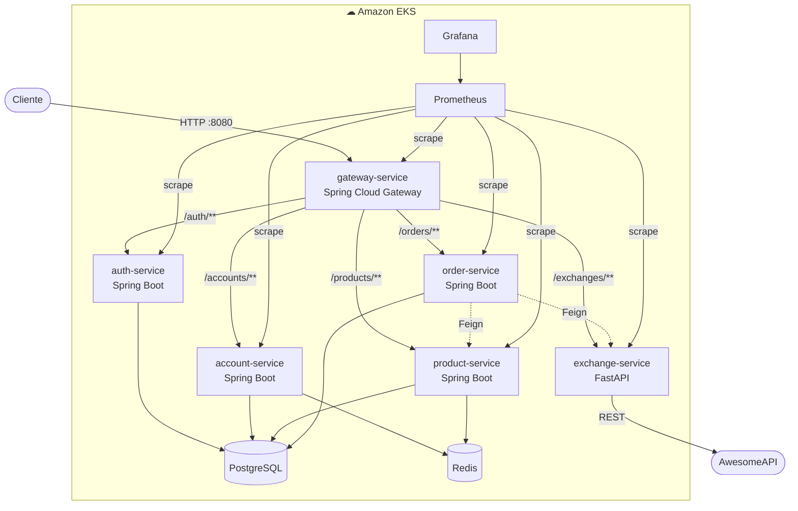

# Plataformas Micro — Grupo 10

???+ info inline end "Semestre"
    2025.1

## Integrantes

| Aluno | RA |
|---|---|
| João Whitaker Citino | — |
| Mateus Porto Pereira Paiva | — |

---

## Sobre o Projeto

O projeto consiste em uma plataforma de e-commerce baseada em **microsserviços**, desenvolvida ao longo do semestre com foco em práticas modernas de engenharia de software: CI/CD, observabilidade, escalabilidade e segurança.

---

## Arquitetura

---

## Serviços

| Serviço | Tecnologia | Repositório |
|---|---|---|
| gateway-service | Spring Cloud Gateway 4 (Java 25) | [Plataformas-Micro/gateway-service](https://github.com/Plataformas-Micro/gateway-service) |
| auth-service | Spring Boot 4 + JWT (Java 25) | [Plataformas-Micro/auth-service](https://github.com/Plataformas-Micro/auth-service) |
| account-service | Spring Boot 4 (Java 25) | [Plataformas-Micro/account-service](https://github.com/Plataformas-Micro/account-service) |
| product-service | Spring Boot 4 (Java 25) | [Plataformas-Micro/product-service](https://github.com/Plataformas-Micro/product-service) |
| exchange-service | Python 3 + FastAPI | [Plataformas-Micro/exchange-service](https://github.com/Plataformas-Micro/exchange-service) |
| order-service | Spring Boot 4 (Java 25) | [Plataformas-Micro/order-service](https://github.com/Plataformas-Micro/order-service) |

---

## Bottlenecks Implementados

| # | Bottleneck | Solução | Responsável |
|---|---|---|---|
| 1 | Latência em leituras repetidas | Redis Cache (account + product) | Grupo |
| 2 | Falta de visibilidade em produção | Prometheus + Grafana | Grupo |
| 3 | Ponto único de falha no gateway | Nginx + HPA (1–10 pods) | Grupo |
| 4 | Consistência histórica de preço em pedidos | Snapshot imutável de `price` em USD no `order_items` | **Mateus Porto** |
| 5 | Acoplamento order ↔ exchange e custo de manutenção de taxas | Conversão de moeda **on-demand** via OpenFeign | **Mateus Porto** |
| 6 | Acesso não autenticado | JWT via auth-service + filtro no gateway | Grupo |
