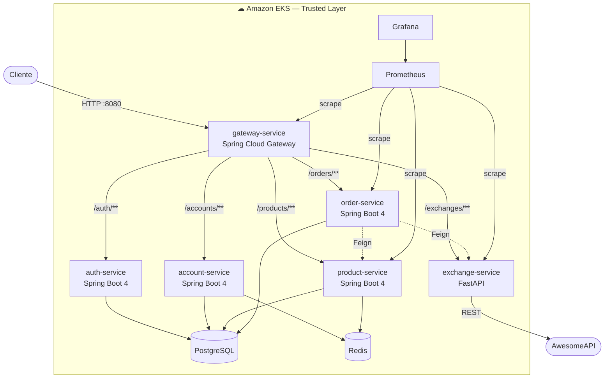

# Store Platform

???+ info inline end "Disciplina"
    Plataformas Micro — Insper
    **Semestre 2026.1 · Grupo 10**

Aplicação web de e-commerce construída com **arquitetura de microsserviços**, com foco
em práticas modernas de engenharia de software: API Gateway, autenticação JWT,
cache distribuído, observabilidade, CI/CD e escalabilidade automática na nuvem.

---

## Sobre o projeto

A plataforma é organizada em torno de serviços independentes — **auth**, **account**,
**product**, **exchange** e **order** — orquestrados por um **API Gateway** que centraliza
o roteamento e a validação de tokens. Todo o tráfego externo entra por uma camada confiável
(*Trusted Layer*); apenas o gateway é exposto à internet.

A stack é majoritariamente **Java 25 / Spring Boot 4.0.3**, com um serviço **poliglota**
em **Python 3.12 / FastAPI** (câmbio). O ambiente roda em **Amazon EKS**, com entrega
contínua via **Jenkins** e observabilidade com **Prometheus + Grafana**.

---

## Repositórios

| Repositório | Descrição |
|---|---|
| [plataforma](https://github.com/Plataformas-Micro/plataforma) | Monorepo — compose, nginx, docs, load-tests |
| [gateway-service](https://github.com/Plataformas-Micro/gateway-service) | API Gateway — roteamento e validação JWT |
| [auth-service](https://github.com/Plataformas-Micro/auth-service) | Emissão e validação de tokens JWT |
| [account-service](https://github.com/Plataformas-Micro/account-service) | CRUD de contas com cache Redis |
| [product-service](https://github.com/Plataformas-Micro/product-service) | CRUD de produtos com cache Redis |
| [exchange-service](https://github.com/Plataformas-Micro/exchange-service) | Câmbio em Python/FastAPI |
| [order-service](https://github.com/Plataformas-Micro/order-service) | Pedidos com snapshot de preço e conversão de moeda |

!!! note "Bibliotecas de contrato"
    Cada serviço Java tem um par `X` (lib compartilhada: interface Feign + DTOs) e
    `X-service` (implementação). A lista completa está em [Referências](referencias.md).

---

## Status de entrega

- [x] Auth API (JWT) + Account API
- [x] Product API (CRUD + cache Redis)
- [x] Exchange API (Python/FastAPI + AwesomeAPI)
- [x] Order API (snapshot de preço + conversão de moeda on-demand)
- [x] API Gateway (roteamento + autenticação)
- [x] Deploy em Amazon EKS
- [x] CI/CD com Jenkins (pipeline por serviço)
- [x] Observabilidade (Prometheus + Grafana)
- [x] Autoscaling (HPA) + load testing com k6
- [x] 6 bottlenecks implementados (2 individuais)

---

## Arquitetura geral

Detalhes em [Arquitetura](arquitetura.md).
