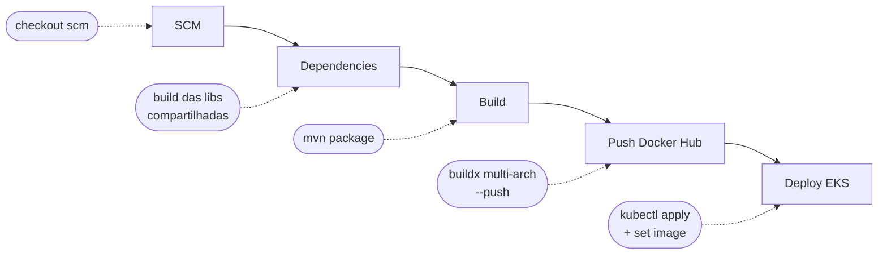
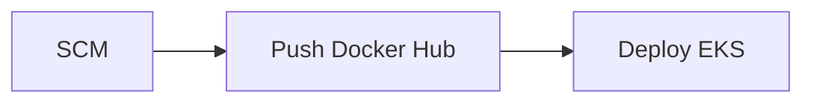

# CI/CD

A plataforma usa **Jenkins** para integração e entrega contínuas. Cada serviço mantém o seu próprio `Jenkinsfile` na raiz do repositório, todos seguindo o mesmo padrão de pipeline: clonar o código, construir as dependências e o artefato, publicar a imagem multi-arquitetura no Docker Hub e, por fim, aplicar o deploy no cluster **EKS**.

Os serviços de aplicação são **Spring Boot 4.0.3 / Java 25**, com exceção do **exchange-service**, escrito em **Python 3.12 / FastAPI**. Todas as imagens são construídas com **Docker Buildx** em modo multi-arquitetura (`linux/amd64`, `linux/arm64`).

!!! tip "Padrão único"
    Embora cada repositório tenha seu próprio `Jenkinsfile`, a estrutura de estágios é idêntica entre os serviços. Isso facilita a manutenção e a previsibilidade dos deploys.

## Estágios do pipeline



| Estágio | Descrição |
|---------|-----------|
| **SCM** | Faz o `checkout scm` do repositório, recuperando o código da revisão que disparou o build. |
| **Dependencies** | Constrói as bibliotecas compartilhadas (jobs upstream das libs comuns), garantindo que o serviço use a versão mais recente das dependências internas. |
| **Build** | Compila e empacota o serviço com `mvn -B -DskipTests clean package`, gerando o artefato a ser containerizado. |
| **Push to Docker Hub** | Faz login no Docker Hub e usa `docker buildx` para construir e publicar a imagem multi-arquitetura (`linux/amd64`, `linux/arm64`), com as tags `:latest` e `:${BUILD_ID}`. |
| **Deploy to EKS** | Atualiza o kubeconfig, aplica os manifestos de `k8s/` e atualiza a imagem do deployment, aguardando a conclusão do rollout. |

O estágio de **Deploy** autentica na AWS usando exclusivamente as duas chaves IAM permanentes e então delega ao `kubectl`:

```groovy title="Jenkinsfile — stage Deploy to EKS"
withCredentials([
    string(credentialsId: 'aws-access-key-id',     variable: 'AWS_ACCESS_KEY_ID'),
    string(credentialsId: 'aws-secret-access-key', variable: 'AWS_SECRET_ACCESS_KEY')
]) {
    sh "aws eks update-kubeconfig --name ${env.CLUSTER_NAME} --region ${env.AWS_REGION}"
    sh "kubectl apply -f k8s/"
    sh "kubectl set image deployment/${env.SERVICE} ${env.SERVICE}=${env.NAME}:${env.BUILD_ID}"
    sh "kubectl rollout status deployment/${env.SERVICE} --timeout=120s"
}
```

O estágio de publicação da imagem segue o padrão do Buildx multi-arquitetura:

```groovy title="Jenkinsfile — stage Push to Docker Hub"
withCredentials([usernamePassword(
    credentialsId: 'dockerhub-credential',
    usernameVariable: 'USERNAME',
    passwordVariable: 'TOKEN')])
{
    sh "docker login -u $USERNAME -p $TOKEN"
    sh "docker buildx create --use --platform=linux/arm64,linux/amd64 --node multi-platform-builder-${env.SERVICE} --name multi-platform-builder-${env.SERVICE}"
    sh "docker buildx build --platform=linux/arm64,linux/amd64 --push --tag ${env.NAME}:latest --tag ${env.NAME}:${env.BUILD_ID} -f Dockerfile ."
    sh "docker buildx rm --force multi-platform-builder-${env.SERVICE}"
}
```

## Pipeline Python (Exchange)

O **exchange-service** é escrito em **Python 3.12 / FastAPI** e, por isso, **não possui o estágio de Build com Maven**. Seu `Jenkinsfile` é mais enxuto: vai direto do **SCM** para o **Push to Docker Hub** (build e publicação da imagem via Buildx) e depois para o **Deploy to EKS**, sem os estágios de `Dependencies` e `mvn package`.



!!! note "Diferença em relação aos serviços Java"
    Como não há compilação Maven, o `Dockerfile` do exchange-service é responsável por instalar as dependências Python diretamente na construção da imagem. O restante do fluxo (Buildx multi-arch + deploy via `kubectl`) é idêntico aos demais.

## Credenciais no Jenkins

| Credencial | Variável | Uso |
|------------|----------|-----|
| `dockerhub-credential` | `USERNAME` / `TOKEN` | Login no Docker Hub para publicar as imagens. |
| `aws-access-key-id` | `AWS_ACCESS_KEY_ID` | Chave de acesso IAM para autenticar na AWS. |
| `aws-secret-access-key` | `AWS_SECRET_ACCESS_KEY` | Chave secreta IAM correspondente. |

!!! info "Credenciais permanentes"
    As chaves IAM são de longa duração (sem token de sessão) e são configuradas em **Manage Jenkins → Credentials**. Não há expiração nem renovação manual durante os builds.

## Imagens Docker Hub

| Serviço | Imagem |
|---------|--------|
| product | `feijonts/product` |
| account | `feijonts/account` |
| auth | `feijonts/auth` |
| gateway | `feijonts/gateway-service` |
| exchange | `feijonts/exchange-service` |
| order | `mateus1711/order` |

!!! note "Namespace do responsável"
    As imagens são publicadas no namespace Docker Hub do membro responsável: `feijonts/*` (João) para a maioria dos serviços e `mateus1711/order` para o Order. Confirme o namespace no `Jenkinsfile` do respectivo repositório (variável `NAME`) antes de alterar manifestos.

Toda build publica a imagem com **duas tags**: `:latest` (referência móvel sempre apontando para o último build) e `:${BUILD_ID}` (tag imutável por build), o que viabiliza rollback para uma versão anterior específica.

## Versionamento e rollback

Cada execução do pipeline gera uma imagem identificada pela tag imutável `${BUILD_ID}`, garantindo rastreabilidade entre o número do build no Jenkins e a imagem publicada.

Para reverter um deploy, basta apontar o deployment para a tag de um build anterior:

```bash title="Rollback para um build anterior"
kubectl set image deployment/<servico> <servico>=<namespace>/<imagem>:<build-anterior>
kubectl rollout status deployment/<servico> --timeout=120s
```

Como a tag `:${BUILD_ID}` é imutável, o rollback é determinístico: o cluster volta exatamente à imagem daquele build.

---

Veja também: [AWS](aws.md) · [EKS](eks.md) · [Serviço de Pedidos](../servicos/order.md)
