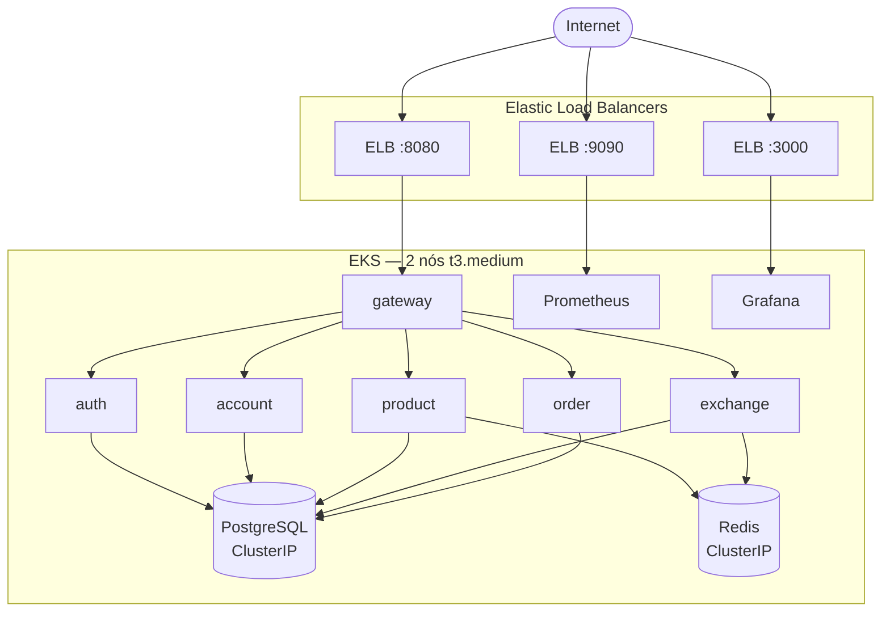

# EKS

O **Amazon EKS** é o cluster Kubernetes gerenciado na AWS que hospeda todos os microsserviços da plataforma. Ele provê escalonamento automático (autoscaling) e observabilidade integrada, mantendo os pods saudáveis e expostos de forma controlada.

## Criação do cluster

O cluster é provisionado com o `eksctl`, que cria automaticamente a VPC, as subnets e o node group gerenciado na região `us-east-1`.

```bash title="Criação do cluster EKS"
eksctl create cluster \
  --name eks-store \
  --region us-east-1 \
  --nodegroup-name standard-workers \
  --node-type t3.medium \
  --nodes 2 \
  --nodes-min 1 \
  --nodes-max 3 \
  --managed
```

!!! note "Node group gerenciado"
    O parâmetro `--managed` delega à AWS o ciclo de vida dos nós (provisionamento, atualização e substituição). Os limites `--nodes-min 1` e `--nodes-max 3` permitem que o **Cluster Autoscaler** ajuste a quantidade de nós conforme a demanda dos pods.

Após a criação, o `kubeconfig` local é atualizado automaticamente. Para validar:

```bash title="Validação dos nós"
kubectl get nodes
```

```text title="Saída esperada"
NAME                             STATUS   ROLES    AGE   VERSION
ip-192-168-12-34.ec2.internal    Ready    <none>   4m    v1.30.0
ip-192-168-56-78.ec2.internal    Ready    <none>   4m    v1.30.0
```

## Arquitetura no cluster

O tráfego externo chega via **Elastic Load Balancers (ELB)** criados pelos Services do tipo `LoadBalancer`. Internamente, os pods se comunicam por Services `ClusterIP`, incluindo o acesso a PostgreSQL e Redis.



## Manifests Kubernetes

Cada repositório de serviço contém uma pasta `k8s/` com os manifests que descrevem a implantação no cluster:

| Arquivo | Responsabilidade |
| --- | --- |
| `deployment.yaml` | Define o Deployment: imagem, réplicas, recursos e variáveis de ambiente. |
| `service.yaml` | Expõe o Deployment dentro (ou fora) do cluster. |
| `configmap.yaml` | Configurações não sensíveis (host/porta do banco, etc.). |
| `secrets.yaml` | Credenciais sensíveis (usuário e senha do banco). |

=== "deployment.yaml"

    ```yaml title="k8s/deployment.yaml"
    apiVersion: apps/v1
    kind: Deployment
    metadata:
      name: product
    spec:
      replicas: 1
      selector:
        matchLabels:
          app: product
      template:
        metadata:
          labels:
            app: product
        spec:
          containers:
            - name: product
              image: feijonts/product:latest
              imagePullPolicy: Always
              ports:
                - containerPort: 8080
              resources:
                requests:
                  memory: "256Mi"
                  cpu: "250m"
                limits:
                  memory: "512Mi"
                  cpu: "500m"
              env:
                - name: DATABASE_HOST
                  valueFrom:
                    configMapKeyRef:
                      name: product-configmap
                      key: DATABASE_HOST
                - name: DATABASE_PORT
                  valueFrom:
                    configMapKeyRef:
                      name: product-configmap
                      key: DATABASE_PORT
                - name: DATABASE_DB
                  valueFrom:
                    configMapKeyRef:
                      name: product-configmap
                      key: DATABASE_DB
                - name: DATABASE_USERNAME
                  valueFrom:
                    secretKeyRef:
                      name: product-secrets
                      key: DATABASE_USERNAME
                - name: DATABASE_PASSWORD
                  valueFrom:
                    secretKeyRef:
                      name: product-secrets
                      key: DATABASE_PASSWORD
                - name: REDIS_HOST
                  value: redis
                - name: REDIS_PORT
                  value: "6379"
    ```

    As variáveis de ambiente são injetadas a partir do `ConfigMap` (`configMapKeyRef`) para dados de configuração e do `Secret` (`secretKeyRef`) para credenciais, mantendo a imagem do container agnóstica ao ambiente.

=== "service.yaml"

    ```yaml title="k8s/service.yaml"
    apiVersion: v1
    kind: Service
    metadata:
      name: product
      labels:
        app: product
    spec:
      type: ClusterIP
      ports:
        - port: 8080
          targetPort: 8080
      selector:
        app: product
    ```

    A maioria dos serviços usa `type: ClusterIP` (acesso apenas interno). Os serviços **gateway**, **Prometheus** e **Grafana** usam `type: LoadBalancer`, o que faz o EKS provisionar um **ELB** público automaticamente.

!!! info "requests.cpu é obrigatório para o HPA"
    O `requests.cpu` (aqui `250m`) é necessário para que o **Horizontal Pod Autoscaler** calcule a utilização percentual de CPU. Sem ele, o HPA não consegue determinar a métrica-alvo e não escala os pods.

## Exposição dos serviços

| Serviço | Tipo | Acesso |
| --- | --- | --- |
| gateway | `LoadBalancer` | ELB público (`:8080`) |
| Prometheus | `LoadBalancer` | ELB público (`:9090`) |
| Grafana | `LoadBalancer` | ELB público (`:3000`) |
| auth | `ClusterIP` | Interno ao cluster |
| account | `ClusterIP` | Interno ao cluster |
| product | `ClusterIP` | Interno ao cluster |
| exchange | `ClusterIP` | Interno ao cluster |
| order | `ClusterIP` | Interno ao cluster |
| PostgreSQL | `ClusterIP` | Interno ao cluster |
| Redis | `ClusterIP` | Interno ao cluster |

## Deploy

Os manifests são aplicados em ordem: primeiro a infraestrutura de dados (PostgreSQL e Redis), depois as aplicações e por fim a stack de observabilidade.

```bash title="Aplicação dos manifests"
# Infraestrutura (PostgreSQL, Redis)
kubectl apply -f k8s/infra/

# Aplicações (gateway, auth, account, product, exchange, order)
kubectl apply -f k8s/apps/

# Observabilidade (Prometheus, Grafana)
kubectl apply -f k8s/observability/
```

```bash title="Verificação dos pods"
kubectl get pods
```

```text title="Saída esperada"
NAME                          READY   STATUS    RESTARTS   AGE
account-7d9c5b8f6-2xk4l       1/1     Running   0          2m
auth-6c8d4f9b7-9pq2m          1/1     Running   0          2m
exchange-5b7c6d8a9-jk3nr      1/1     Running   0          2m
gateway-8f6d7c5b4-l8wzs       1/1     Running   0          2m
order-9a8b7c6d5-m4xtp         1/1     Running   0          2m
product-7c6b5a4d3-q7vnf       1/1     Running   0          2m
postgres-0                    1/1     Running   0          3m
redis-6d5c4b3a2-z9hkt         1/1     Running   0          3m
```

## HPA — Horizontal Pod Autoscaler

O HPA ajusta automaticamente o número de réplicas de um Deployment com base na utilização de CPU. O exemplo abaixo configura o `gateway` para escalar entre 1 e 10 réplicas, mantendo a CPU próxima de 50%:

```bash title="Configuração do HPA do gateway"
kubectl autoscale deployment gateway --cpu-percent=50 --min=1 --max=10
```

```bash title="Status do HPA"
kubectl get hpa
```

```text title="Saída esperada"
NAME      REFERENCE            TARGETS    MINPODS   MAXPODS   REPLICAS   AGE
gateway   Deployment/gateway   23%/50%    1         10        1          1m
```

!!! info "Cooldown"
    Após um evento de escala, o HPA respeita uma janela de estabilização de aproximadamente **5 minutos** antes de reduzir réplicas. Isso evita oscilações (flapping) em picos de carga de curta duração.

Veja o comportamento sob carga em [Testes de Carga](../testes-de-carga.md). Para entender os pontos de saturação observados, consulte [Bottlenecks](../bottlenecks.md).

---

Relacionados: [AWS](aws.md) · [CI/CD](cicd.md) · [Testes de Carga](../testes-de-carga.md) · [Bottlenecks](../bottlenecks.md)
