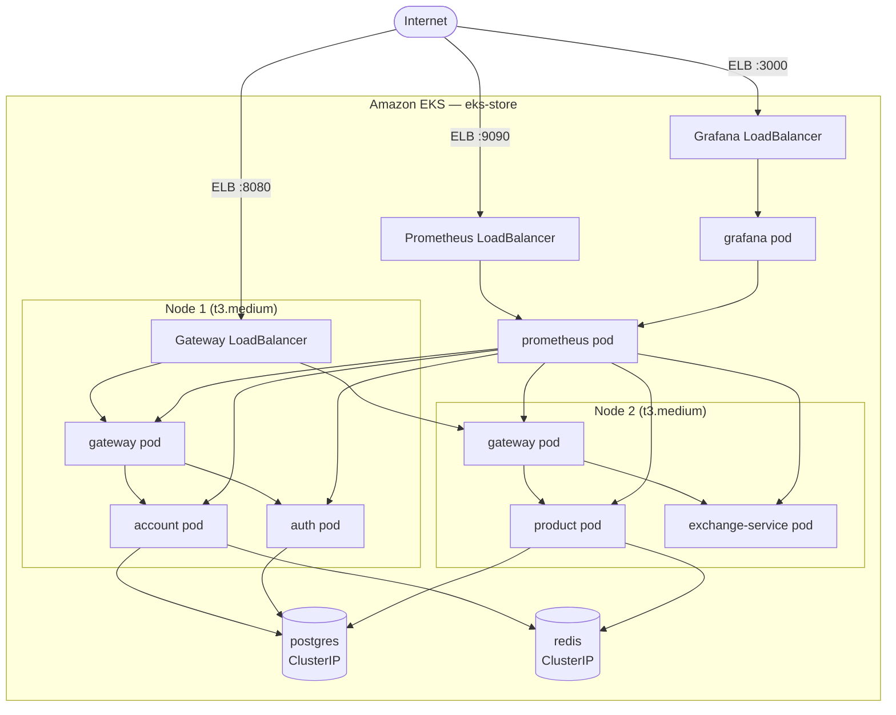

# AWS & EKS

!!! abstract "Objetivo"
    Deploy de toda a plataforma no **Amazon EKS** com escalabilidade automática, observabilidade e CI/CD integrado via Jenkins.

---

## Cluster EKS

Cluster criado com `eksctl` na região `us-east-1`:

```bash
eksctl create cluster \
  --name eks-store \
  --region us-east-1 \
  --nodegroup-name standard-workers \
  --node-type t3.medium \    # (1)
  --nodes 2 \               # (2)
  --nodes-min 1 \
  --nodes-max 3 \
  --managed                 # (3)
```

1. `t3.medium` — 2 vCPU, 4GB RAM por nó. Suficiente para rodar todos os serviços.
2. 2 nós iniciais para distribuir os pods.
3. Nodegroup gerenciado pela AWS (atualizações automáticas do OS).

```bash
kubectl get nodes

NAME                          STATUS   ROLES    AGE   VERSION
ip-192-168-x-x.ec2.internal   Ready    <none>   10m   v1.30
ip-192-168-x-x.ec2.internal   Ready    <none>   10m   v1.30
```

---

## Arquitetura no EKS



---

## Manifests Kubernetes

Cada serviço possui um diretório `k8s/` com os manifests:

=== "deployment.yaml"

    ```yaml title="product-service/k8s/deployment.yaml"
    apiVersion: apps/v1
    kind: Deployment
    metadata:
      name: product
    spec:
      replicas: 1
      selector:
        matchLabels:
          app: product
      template:
        metadata:
          labels:
            app: product
        spec:
          containers:
            - name: product
              image: feijonts/product:latest
              ports:
                - containerPort: 8080
              resources:
                requests:
                  memory: "256Mi"
                  cpu: "250m"    # (1)!
                limits:
                  memory: "512Mi"
                  cpu: "500m"
              env:
                - name: DB_HOST
                  value: postgres
                - name: REDIS_HOST
                  value: redis   # (2)!
                - name: REDIS_PORT
                  value: "6379"
    ```

    1. `requests.cpu` é obrigatório para o HPA calcular a porcentagem de uso.
    2. O Kubernetes resolve `redis` para o ClusterIP do Service correspondente.

=== "service.yaml"

    ```yaml title="gateway-service/k8s/service.yaml"
    apiVersion: v1
    kind: Service
    metadata:
      name: gateway
    spec:
      type: LoadBalancer  # (1)!
      ports:
        - port: 8080
          targetPort: 8080
      selector:
        app: gateway
    ```

    1. `LoadBalancer` provisiona automaticamente um **AWS ELB** com IP público. Os demais serviços usam `ClusterIP`.

---

## Serviços e Exposição

| Serviço | K8s Service Type | Porta | Acesso |
|---|---|---|---|
| gateway | LoadBalancer | 8080 | Externo (ELB) |
| prometheus | LoadBalancer | 9090 | Externo (ELB) |
| grafana | LoadBalancer | 3000 | Externo (ELB) |
| account | ClusterIP | 8080 | Interno |
| auth | ClusterIP | 8080 | Interno |
| product | ClusterIP | 8080 | Interno |
| exchange-service | ClusterIP | 8080 | Interno |
| postgres | ClusterIP | 5432 | Interno |
| redis | ClusterIP | 6379 | Interno |

---

## Deploy dos Serviços

Deploy inicial de todos os serviços:

```bash
# Infraestrutura
kubectl apply -f postgres-service/k8s/
kubectl apply -f redis-service/k8s/

# Aplicação
kubectl apply -f account-service/k8s/
kubectl apply -f auth-service/k8s/
kubectl apply -f product-service/k8s/
kubectl apply -f exchange-service/k8s/
kubectl apply -f gateway-service/k8s/

# Observabilidade
kubectl apply -f prometheus-service/k8s/
kubectl apply -f grafana-service/k8s/
```

Verificando que todos os pods estão Running:

```bash
kubectl get pods

NAME                                READY   STATUS    RESTARTS
account-xxx                         1/1     Running   0
auth-xxx                            1/1     Running   0
exchange-service-xxx                1/1     Running   0
gateway-xxx                         1/1     Running   0
grafana-xxx                         1/1     Running   0
postgres-xxx                        1/1     Running   0
product-xxx                         1/1     Running   0
prometheus-xxx                      1/1     Running   0
redis-xxx                           1/1     Running   0
```

---

## HPA — Horizontal Pod Autoscaler

```bash
kubectl autoscale deployment gateway \
  --cpu-percent=50 \
  --min=1 \
  --max=10
```

Verificando o estado do HPA:

```bash
kubectl get hpa gateway

NAME      REFERENCE              TARGETS      MINPODS   MAXPODS   REPLICAS
gateway   Deployment/gateway     cpu: 0%/50%  1         10        1
```

!!! warning "Credenciais AWS SSO"
    As credenciais AWS SSO expiram a cada **1 hora**. Para o pipeline Jenkins funcionar, as credenciais `aws-access-key-id`, `aws-secret-access-key` e `aws-session-token` devem ser atualizadas periodicamente em **Manage Jenkins → Credentials**.
