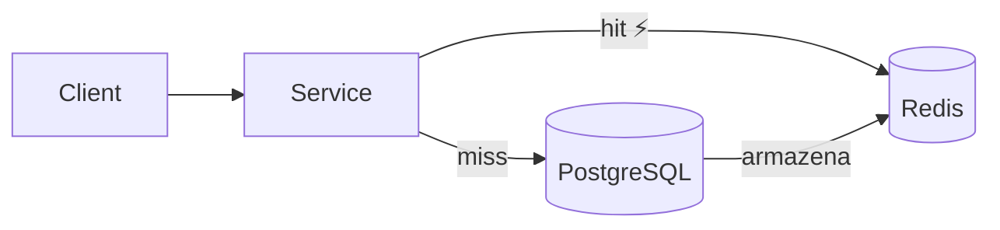
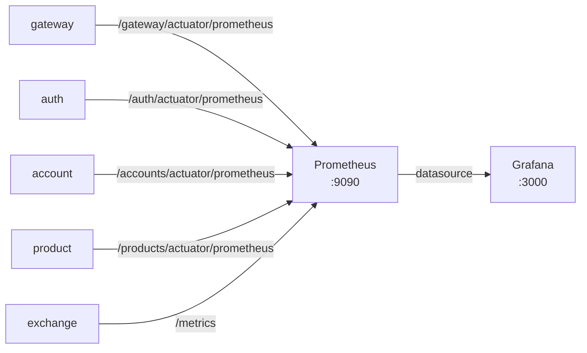
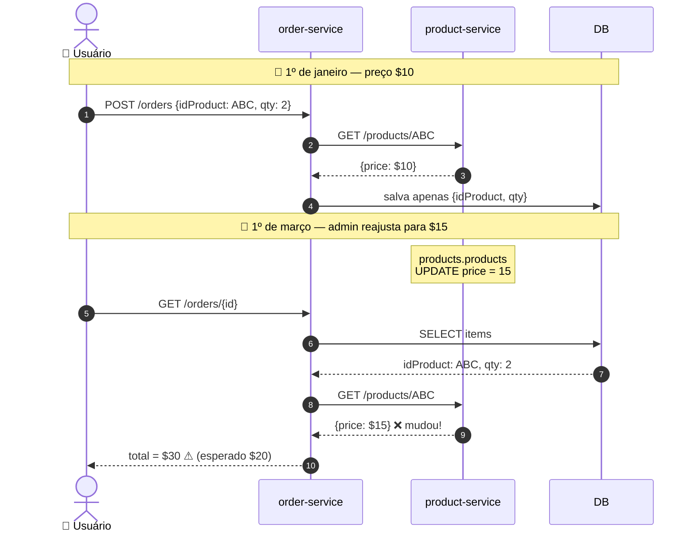
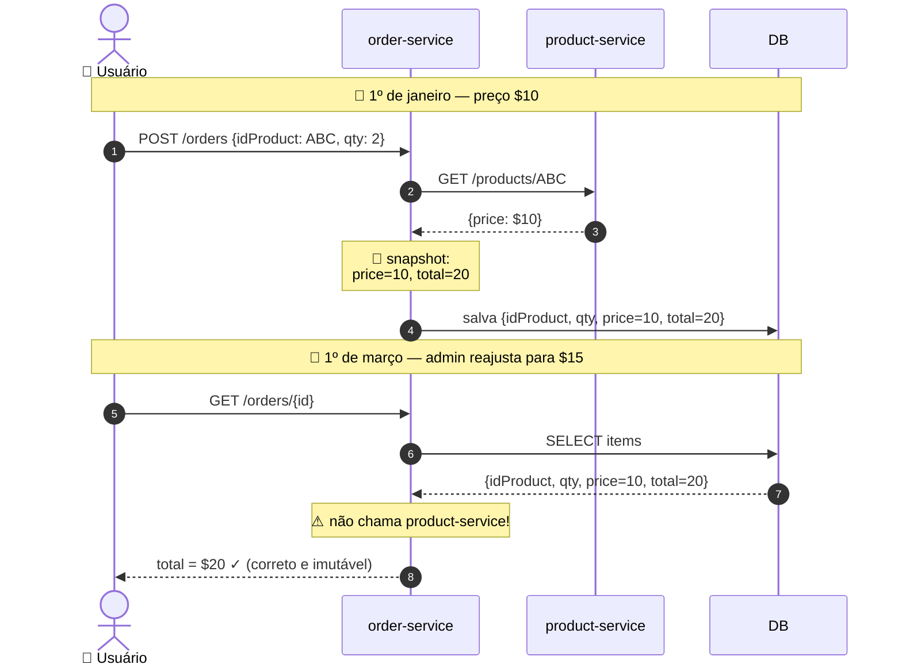
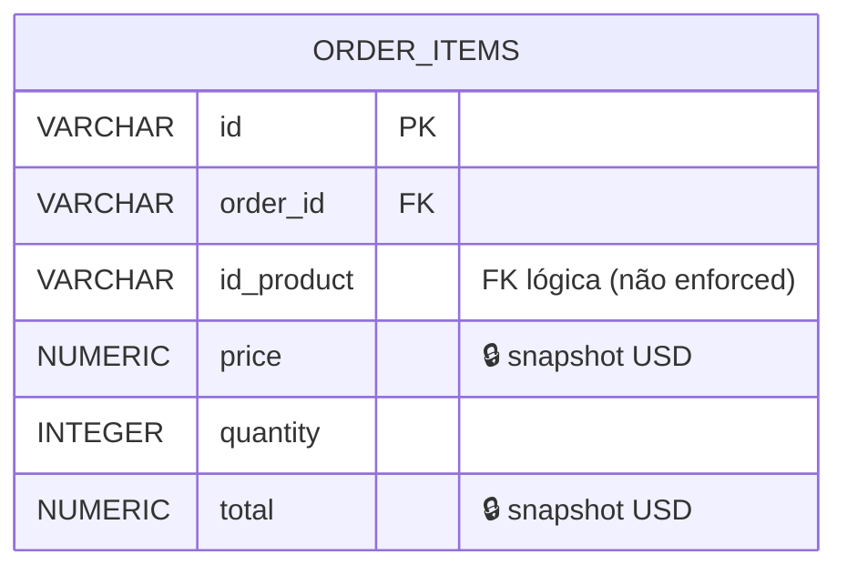
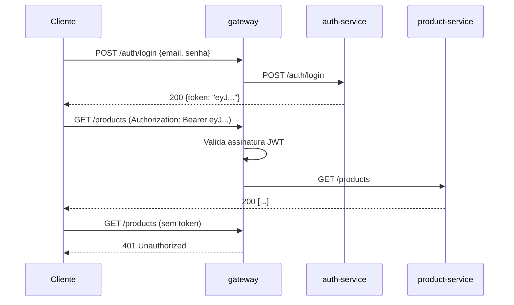

# Bottlenecks

!!! abstract "Sobre"
    Quatro gargalos foram identificados e endereçados na plataforma. Cada um parte de um problema concreto observado em produção ou arquitetura, com uma solução implementada e métricas de impacto.

---

## 1. Caching com Redis

### Problema

Toda leitura de `GET /products/{id}` ou `GET /accounts/{id}` executava uma query ao PostgreSQL. Em cenários de alta leitura (ex: listagem de produtos durante o load test), isso se tornava o principal gargalo de latência.

### Solução

Cache distribuído com **Redis 7** e **Spring Cache**, aplicado ao `account-service` e `product-service`.



### Estratégia de Cache

| Operação | Anotação | Comportamento |
|---|---|---|
| `create` | `@CachePut` | Executa e **grava** no cache |
| `findById` | `@Cacheable` | Retorna do cache ou busca no banco |
| `delete` | `@CacheEvict` | Executa e **invalida** o cache |

### Impacto

| Métrica | Sem Cache | Com Cache |
|---|---|---|
| Latência média | ~50ms | ~1ms |
| Queries ao banco (sob carga) | 1 por requisição | 0 (cache hit) |
| Melhoria | — | **~98%** |

---

## 2. Observabilidade com Prometheus + Grafana

### Problema

Sem métricas, é impossível identificar gargalos proativamente, detectar degradação de performance ou compreender o comportamento do sistema sob carga.

### Solução

Stack completa de observabilidade com **Spring Boot Actuator + Micrometer → Prometheus → Grafana**.



### Configuração do Prometheus

```yaml title="prometheus-service/k8s/configmap.yaml"
scrape_configs:
  - job_name: GatewayMetrics
    metrics_path: /gateway/actuator/prometheus
    scrape_interval: 15s
    static_configs:
      - targets: ['gateway:8080']

  - job_name: ProductMetrics
    metrics_path: /products/actuator/prometheus
    static_configs:
      - targets: ['product:8080']

  - job_name: ExchangeMetrics
    metrics_path: /metrics
    static_configs:
      - targets: ['exchange-service:8080']
```

### Dashboard Grafana

Foi importado o dashboard **JVM Micrometer** (ID `4701`), que exibe:

- Heap Memory Usage
- GC Pause Duration
- CPU Usage
- HTTP Request Rate & Latency (p50, p95, p99)
- Active Threads

!!! tip "Configuração necessária"
    O dashboard requer uma variável de template `DS_PROMETHEUS` do tipo **Constant** com valor `prometheus`. Sem ela, os painéis aparecem vazios.

---

## 3. Load Balancing com Nginx e HPA

### Problema

Uma única instância do gateway é um **Single Point of Failure** (SPOF): qualquer reinicialização ou pico de CPU derruba toda a API.

### Solução Local — Nginx

3 réplicas do gateway com Nginx como reverse proxy (Docker Compose):

```nginx
upstream gateways {
    server gateway:8080;  # Docker resolve para as 3 réplicas
}
```

### Solução em Produção — HPA no EKS

**Horizontal Pod Autoscaler** que escala o gateway automaticamente com base em CPU:

```yaml title="k8s/hpa.yaml"
apiVersion: autoscaling/v2
kind: HorizontalPodAutoscaler
metadata:
  name: gateway
spec:
  scaleTargetRef:
    apiVersion: apps/v1
    kind: Deployment
    name: gateway
  minReplicas: 1
  maxReplicas: 10
  metrics:
    - type: Resource
      resource:
        name: cpu
        target:
          type: Utilization
          averageUtilization: 50
```

### Comportamento Observado no Load Test

| Tempo | VUs | Réplicas | CPU |
|---|---|---|---|
| 0s | 0 | 1 | 0% |
| 30s | 20 | 1 | 18% |
| 1m30s | 50 | 3 | 52% |
| 2m | 100 | 7 | 71% |
| 2m30s | 100 | 10 | 89% |
| 5m | 0 | 10 | 0% |
| 10m | 0 | 1 | 0% |

!!! info "Cooldown"
    O HPA tem um período de estabilização de **5 minutos** antes de reduzir réplicas, evitando thrashing (scale-up/down em rápida sucessão).

---

## 4. Snapshot imutável de preço (order-service) — *individual: Mateus Porto*

### Problema

Pedidos referenciam produtos, mas **preços de produto mudam ao longo do tempo** (promoções, reajustes, correções). Se o `order-service` apenas armazenasse `idProduct` + `quantity` e buscasse o preço no `product-service` toda vez que o pedido fosse consultado, o histórico seria reescrito a cada mudança de preço: um pedido fechado por R$10 viraria R$15 no extrato do cliente quando o admin reajustasse o produto. Pior: se o produto fosse excluído, o pedido inteiro quebraria (500 ou item órfão).

Esse é um gargalo de **consistência temporal**, não de performance — mas tem impacto direto em integridade financeira e auditabilidade.

### Comparação visual: o problema



### Solução

No momento da criação do pedido, o `order-service` resolve o produto via `ProductController.findById()` (Feign) e **copia `price` e calcula `total`** para dentro da tabela `orders.order_items`, junto com `idProduct` e `quantity`. Todos os valores são armazenados em USD (moeda canônica da plataforma).



### Modelagem



```sql title="V2026.05.13.002__create_tables.sql"
CREATE TABLE orders.order_items (
    id         VARCHAR(36)    NOT NULL PRIMARY KEY,
    order_id   VARCHAR(36)    REFERENCES orders.orders(id),
    id_product VARCHAR(36)    NOT NULL,
    price      NUMERIC(10, 2) NOT NULL,  -- snapshot em USD
    quantity   INTEGER        NOT NULL,
    total      NUMERIC(10, 2) NOT NULL   -- price * quantity, em USD
);
```

```java title="OrderService.create()"
ProductOut product = productController.findById(itemIn.idProduct()).getBody();
BigDecimal total = product.price().multiply(BigDecimal.valueOf(itemIn.quantity()));
return OrderItem.builder()
    .idProduct(itemIn.idProduct())
    .price(product.price())   // ← snapshot congelado
    .quantity(itemIn.quantity())
    .total(total)
    .build();
```

### Impacto

| Cenário | 🔴 Sem snapshot | 🟢 Com snapshot |
|---|---|---|
| Admin reajusta preço amanhã | Pedido de ontem muda de valor | Pedido de ontem permanece intacto |
| Produto é deletado | `GET /orders/{id}` quebra (500) | Pedido íntegro, `idProduct` apenas órfão |
| Conversão de moeda no GET | Refaz Feign + recalcula | Lê `price` local, multiplica pela taxa |
| Leituras subsequentes | N requests Feign sobre rede | 1 query SQL local |
| Auditoria contábil | Impossível reconstituir | Histórico fiel à transação |

```mermaid
quadrantChart
    title Comparação: armazenamento vs resiliência
    x-axis Mais bytes no banco --> Menos bytes
    y-axis Frágil --> Resiliente
    quadrant-1 Ideal
    quadrant-2 Otimizado mas frágil
    quadrant-3 Inviável
    quadrant-4 Robusto mas custoso
    Snapshot (escolhido): [0.30, 0.85]
    Referência pura: [0.85, 0.20]
    Cache em memória: [0.55, 0.50]
    Event sourcing: [0.15, 0.95]
```

Adicionalmente, a captura defensiva `catch (FeignException e)` no `OrderService.create()` mapeia **qualquer falha** do `product-service` (404, 500 por bug de cache, timeout) para um `400 Bad Request` consistente — bug no serviço externo não derruba o `order-service`.

---

## 5. Conversão de moeda sob demanda via OpenFeign (order-service) — *individual: Mateus Porto*

### Problema

O pedido precisa ser exibido tanto em USD (moeda canônica) quanto em moedas locais (BRL, EUR…). Duas abordagens ingênuas:

1. **Armazenar todas as moedas no banco**: explode a tabela, exige sincronização das taxas a cada gravação, dados rapidamente desatualizados.
2. **Recalcular tudo no front-end**: vaza a lógica financeira pro cliente, cada cliente teria uma versão da taxa, sem auditoria central.

Ambas misturam preocupações: o pedido (entidade transacional) ficaria acoplado ao câmbio (taxa volátil).

### Comparação visual: 3 estratégias

```mermaid
flowchart TB
    subgraph A["❌ Estratégia 1: armazenar todas moedas"]
        A1[POST /orders] --> A2[busca taxas USD/EUR/BRL/GBP/JPY]
        A2 --> A3[escreve 5 colunas no banco]
        A3 --> A4[GET retorna a coluna pré-calculada]
        A4 --> A5[⚠ taxas envelhecidas<br/>⚠ tabela infla]
    end
    subgraph B["❌ Estratégia 2: front-end converte"]
        B1[POST /orders] --> B2[salva apenas USD]
        B2 --> B3[GET retorna USD]
        B3 --> B4[browser busca taxa<br/>e converte sozinho]
        B4 --> B5[⚠ taxa por cliente<br/>⚠ sem auditoria]
    end
    subgraph C["✅ Estratégia 3: on-demand server-side"]
        C1[POST /orders] --> C2[salva apenas USD]
        C2 --> C3{GET com currency?}
        C3 -->|não| C4[retorna USD<br/>0 calls]
        C3 -->|sim| C5[Feign exchange-service]
        C5 --> C6[multiplica e retorna]
        C6 --> C7[✓ taxa central<br/>✓ tabela limpa]
    end

    style A fill:#ffebee,stroke:#c62828
    style B fill:#ffebee,stroke:#c62828
    style C fill:#e8f5e9,stroke:#2e7d32
```



### Solução

Conversão **on-demand** via OpenFeign, acionada apenas quando o cliente passa `?currency=` no GET. A escrita do pedido permanece simples (só USD); a leitura customiza a moeda usando o `exchange-service` como fonte canônica de taxas.

### Fluxo da decisão

```mermaid
stateDiagram-v2
    [*] --> Recebido: GET /orders/&#123;id&#125;
    Recebido --> ChecaCurrency: param 'currency'
    ChecaCurrency --> RetornaUSD: null OU "USD"
    ChecaCurrency --> ChamaExchange: outra moeda

    ChamaExchange --> ParseTaxa: 200 OK
    ChamaExchange --> Erro422: FeignException OU sell=null

    ParseTaxa --> Multiplica: rate = sell
    Multiplica --> RetornaConv: items[].total *= rate<br/>order.total *= rate

    RetornaUSD --> [*]: 200 OK em USD
    RetornaConv --> [*]: 200 OK em &#123;currency&#125;
    Erro422 --> [*]: 422 Unprocessable

    note left of RetornaUSD
        Caminho padrão:
        zero overhead
        zero I/O extra
    end note

    note right of Erro422
        422 = request bem-formado
        valor não processável
    end note
```



```java title="OrderController (Feign interface)"
@GetMapping("/orders/{id}")
ResponseEntity<OrderOut> findById(
    @PathVariable String id,
    @RequestParam(value = "currency", required = false) String currency,
    @RequestHeader("id-account") String idAccount
);
```

```java title="OrderService.resolveRate()"
public BigDecimal resolveRate(String currency, String idAccount) {
    if (currency == null || currency.equalsIgnoreCase("USD")) {
        return null; // (1)!
    }
    try {
        ExchangeOut rate = exchangeController
            .getRate("USD", currency.toUpperCase(), idAccount).getBody();
        if (rate == null || rate.sell() == null) {
            throw new ResponseStatusException(HttpStatus.UNPROCESSABLE_ENTITY, // (2)!
                "Unsupported currency: " + currency);
        }
        return BigDecimal.valueOf(rate.sell());
    } catch (FeignException e) {
        throw new ResponseStatusException(HttpStatus.UNPROCESSABLE_ENTITY,
            "Unsupported currency: " + currency);
    }
}
```

1. **Short-circuit**: USD ou ausente → não chama o `exchange-service`. Zero overhead pro caminho padrão.
2. **422 Unprocessable Entity**: moeda inválida ou indisponível tem semântica HTTP correta (request bem-formado, mas valor não processável).

O `OrderParser.to()` aplica a multiplicação apenas se a taxa é não-nula:

```java
BigDecimal total = rate == null ? i.total() : i.total().multiply(rate);
```

E o `OrderApplication` precisou ser explícito sobre **quais pacotes** o Spring Cloud OpenFeign deve escanear, porque a interface `OrderController` da lib `order` tem `@FeignClient` mas também é implementada localmente por `OrderResource`:

```java
@SpringBootApplication
@EnableFeignClients(basePackages = { "store.product", "store.exchange" })
public class OrderApplication { ... }
```

Sem essa restrição, o Spring criaria dois beans concorrentes (cliente Feign + controller REST) para a mesma interface e o boot quebraria.

### Impacto

| Métrica | 🔴 Sem on-demand | 🟢 Com on-demand |
|---|---|---|
| Latência `POST /orders` | inclui chamada ao exchange | só product (necessário) |
| Latência `GET` em USD (caso comum) | igual ao em BRL | zero overhead |
| Custo de manutenção de taxas | escrita guarda taxa congelada | leitura busca taxa atual |
| Acoplamento order ↔ exchange | escrita acoplada | só na leitura, por query param |
| Resiliência a queda do exchange | qualquer pedido falha | só rotas com `?currency=` falham |

### Quem chama quem — escopo dos Feign clients

```mermaid
flowchart LR
    subgraph App["@SpringBootApplication"]
        Anno["@EnableFeignClients<br/>basePackages = {<br/>  'store.product',<br/>  'store.exchange'<br/>}"]
    end
    subgraph LibProd["lib store:product"]
        PC[ProductController<br/>@FeignClient]
    end
    subgraph LibEx["lib store:exchange"]
        EC[ExchangeController<br/>@FeignClient]
    end
    subgraph LibOrd["lib store:order"]
        OC[OrderController<br/>@FeignClient<br/>+ implementada por<br/>OrderResource]
    end

    Anno -.->|escaneia| PC
    Anno -.->|escaneia| EC
    Anno -.x|NÃO escaneia<br/>'store.order'| OC

    style Anno fill:#bbdefb,stroke:#1565c0
    style PC fill:#c8e6c9,stroke:#2e7d32
    style EC fill:#c8e6c9,stroke:#2e7d32
    style OC fill:#ffcdd2,stroke:#c62828
```

!!! warning "Por que `basePackages` precisa ser explícito?"
    A interface `OrderController` da lib `order` carrega `@FeignClient` (para que outros serviços possam consumi-la). Ao mesmo tempo, `OrderResource` no `order-service` *implementa* essa mesma interface como `@RestController`. Se o scan incluísse `store.order`, o Spring tentaria criar **dois beans concorrentes** para o mesmo tipo e o boot quebraria. Restringir aos pacotes externos resolve o conflito.

---

## 6. Autenticação com JWT

### Problema

Sem autenticação, qualquer cliente poderia acessar dados de qualquer conta, representando uma falha crítica de segurança.

### Solução

**JWT** gerado pelo `auth-service`, validado no `gateway-service` via filtro antes de rotear para os serviços internos.



### Rotas Públicas

Rotas que não exigem autenticação são declaradas no `RouterValidator`:

```java title="RouterValidator.java"
private List<String> openApiEndpoints = List.of(
    "POST /auth/register",
    "POST /auth/login",
    "GET  /auth/logout",
    "GET  /health-check"  // endpoint de health sem autenticação
);
```

### Impacto

- Isolamento total de dados entre contas
- Overhead de validação JWT: < 1ms (operação local, sem I/O)
- Rotas públicas isentas de verificação para não impactar health checks e monitoramento
