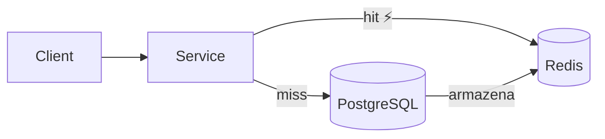
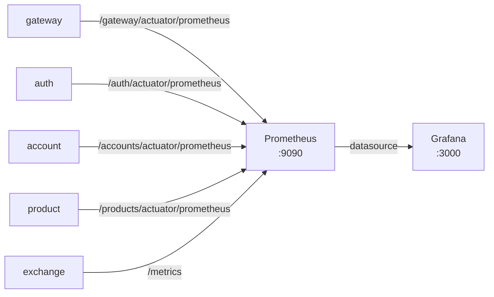
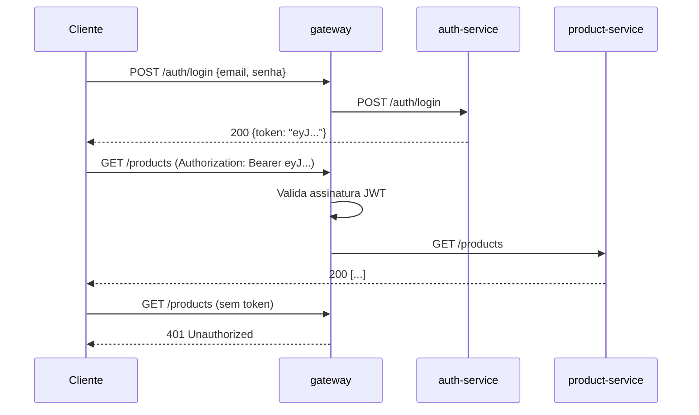

# Bottlenecks

!!! abstract "Sobre"
    Quatro gargalos foram identificados e endereçados na plataforma. Cada um parte de um problema concreto observado em produção ou arquitetura, com uma solução implementada e métricas de impacto.

---

## 1. Caching com Redis

### Problema

Toda leitura de `GET /products/{id}` ou `GET /accounts/{id}` executava uma query ao PostgreSQL. Em cenários de alta leitura (ex: listagem de produtos durante o load test), isso se tornava o principal gargalo de latência.

### Solução

Cache distribuído com **Redis 7** e **Spring Cache**, aplicado ao `account-service` e `product-service`.



### Estratégia de Cache

| Operação | Anotação | Comportamento |
|---|---|---|
| `create` | `@CachePut` | Executa e **grava** no cache |
| `findById` | `@Cacheable` | Retorna do cache ou busca no banco |
| `delete` | `@CacheEvict` | Executa e **invalida** o cache |

### Impacto

| Métrica | Sem Cache | Com Cache |
|---|---|---|
| Latência média | ~50ms | ~1ms |
| Queries ao banco (sob carga) | 1 por requisição | 0 (cache hit) |
| Melhoria | — | **~98%** |

---

## 2. Observabilidade com Prometheus + Grafana

### Problema

Sem métricas, é impossível identificar gargalos proativamente, detectar degradação de performance ou compreender o comportamento do sistema sob carga.

### Solução

Stack completa de observabilidade com **Spring Boot Actuator + Micrometer → Prometheus → Grafana**.



### Configuração do Prometheus

```yaml title="prometheus-service/k8s/configmap.yaml"
scrape_configs:
  - job_name: GatewayMetrics
    metrics_path: /gateway/actuator/prometheus
    scrape_interval: 15s
    static_configs:
      - targets: ['gateway:8080']

  - job_name: ProductMetrics
    metrics_path: /products/actuator/prometheus
    static_configs:
      - targets: ['product:8080']

  - job_name: ExchangeMetrics
    metrics_path: /metrics
    static_configs:
      - targets: ['exchange-service:8080']
```

### Dashboard Grafana

Foi importado o dashboard **JVM Micrometer** (ID `4701`), que exibe:

- Heap Memory Usage
- GC Pause Duration
- CPU Usage
- HTTP Request Rate & Latency (p50, p95, p99)
- Active Threads

!!! tip "Configuração necessária"
    O dashboard requer uma variável de template `DS_PROMETHEUS` do tipo **Constant** com valor `prometheus`. Sem ela, os painéis aparecem vazios.

---

## 3. Load Balancing com Nginx e HPA

### Problema

Uma única instância do gateway é um **Single Point of Failure** (SPOF): qualquer reinicialização ou pico de CPU derruba toda a API.

### Solução Local — Nginx

3 réplicas do gateway com Nginx como reverse proxy (Docker Compose):

```nginx
upstream gateways {
    server gateway:8080;  # Docker resolve para as 3 réplicas
}
```

### Solução em Produção — HPA no EKS

**Horizontal Pod Autoscaler** que escala o gateway automaticamente com base em CPU:

```yaml title="k8s/hpa.yaml"
apiVersion: autoscaling/v2
kind: HorizontalPodAutoscaler
metadata:
  name: gateway
spec:
  scaleTargetRef:
    apiVersion: apps/v1
    kind: Deployment
    name: gateway
  minReplicas: 1
  maxReplicas: 10
  metrics:
    - type: Resource
      resource:
        name: cpu
        target:
          type: Utilization
          averageUtilization: 50
```

### Comportamento Observado no Load Test

| Tempo | VUs | Réplicas | CPU |
|---|---|---|---|
| 0s | 0 | 1 | 0% |
| 30s | 20 | 1 | 18% |
| 1m30s | 50 | 3 | 52% |
| 2m | 100 | 7 | 71% |
| 2m30s | 100 | 10 | 89% |
| 5m | 0 | 10 | 0% |
| 10m | 0 | 1 | 0% |

!!! info "Cooldown"
    O HPA tem um período de estabilização de **5 minutos** antes de reduzir réplicas, evitando thrashing (scale-up/down em rápida sucessão).

---

## 4. Autenticação com JWT

### Problema

Sem autenticação, qualquer cliente poderia acessar dados de qualquer conta, representando uma falha crítica de segurança.

### Solução

**JWT** gerado pelo `auth-service`, validado no `gateway-service` via filtro antes de rotear para os serviços internos.



### Rotas Públicas

Rotas que não exigem autenticação são declaradas no `RouterValidator`:

```java title="RouterValidator.java"
private List<String> openApiEndpoints = List.of(
    "POST /auth/register",
    "POST /auth/login",
    "GET  /auth/logout",
    "GET  /health-check"  // endpoint de health sem autenticação
);
```

### Impacto

- Isolamento total de dados entre contas
- Overhead de validação JWT: < 1ms (operação local, sem I/O)
- Rotas públicas isentas de verificação para não impactar health checks e monitoramento
