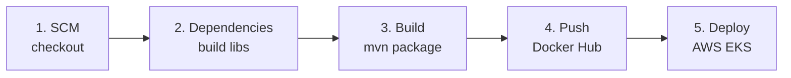

# Jenkins CI/CD

!!! abstract "Objetivo"
    Pipeline de integração e entrega contínua automatizando o ciclo completo: **build → containerização → push → deploy no EKS** a cada commit.

---

## Infraestrutura do Jenkins

O Jenkins roda como container Docker com todas as ferramentas necessárias instaladas na imagem:

```dockerfile title="jenkins/Dockerfile"
FROM jenkins/jenkins:jdk21
USER root

# Maven
RUN apt-get update && apt-get install -y maven

# Docker CLI
RUN curl -fsSLo /usr/share/keyrings/docker-archive-keyring.asc \
    https://download.docker.com/linux/debian/gpg
RUN echo "deb [arch=$(dpkg --print-architecture) \
    signed-by=/usr/share/keyrings/docker-archive-keyring.asc] \
    https://download.docker.com/linux/debian \
    $(lsb_release -cs) stable" > /etc/apt/sources.list.d/docker.list
RUN apt-get update && apt-get install -y docker-ce-cli

# kubectl
RUN curl -fsSL https://pkgs.k8s.io/core:/stable:/v1.30/deb/Release.key \
    | gpg --dearmor -o /etc/apt/keyrings/kubernetes-apt-keyring.gpg
RUN echo 'deb [signed-by=/etc/apt/keyrings/kubernetes-apt-keyring.gpg] \
    https://pkgs.k8s.io/core:/stable:/v1.30/deb/ /' \
    | tee /etc/apt/sources.list.d/kubernetes.list
RUN apt-get update && apt-get install -y kubectl

# AWS CLI
RUN curl "https://awscli.amazonaws.com/awscli-exe-linux-x86_64.zip" -o "awscliv2.zip" \
    && unzip awscliv2.zip && ./aws/install && rm -rf aws awscliv2.zip

RUN usermod -aG docker jenkins
USER jenkins
```

---

## Estágios do Pipeline



### Estágio 1 — SCM

```groovy
stage('SCM') {
    steps { checkout scm }
}
```

### Estágio 2 — Dependencies

Algumas bibliotecas são módulos Maven compartilhados que precisam estar no repositório local antes do build do serviço.

!!! warning "Ordem importa"
    O `auth-service` depende da lib `auth`, que por sua vez depende da lib `account`. Ambas precisam ser buildadas **nessa ordem**.

```groovy
stage('Dependencies') {
    steps {
        build job: 'account', wait: true // (1)!
        build job: 'auth',    wait: true // (2)!
    }
}
```

1. Instala `store:account:jar:1.0.0` no Maven local do Jenkins.
2. Instala `store:auth:jar:1.0.0` — depende do `account` já instalado.

### Estágio 3 — Build

```groovy
stage('Build') {
    steps {
        sh 'mvn -B -DskipTests clean package' // (1)!
    }
}
```

1. `-B` modo batch (sem interatividade), `-DskipTests` pula testes para agilizar o pipeline.

### Estágio 4 — Push to Docker Hub

Build **multi-plataforma** (arm64 para Mac M1/M2, amd64 para os nós EC2 do EKS):

```groovy
stage('Push to Docker Hub') {
    steps {
        withCredentials([usernamePassword(
            credentialsId: 'dockerhub-credential',
            usernameVariable: 'USERNAME',
            passwordVariable: 'TOKEN'
        )]) {
            sh "docker login -u $USERNAME -p $TOKEN"
            sh """docker buildx create --use \
                --platform=linux/arm64,linux/amd64 \
                --name multi-platform-builder-${env.SERVICE}"""
            sh """docker buildx build \
                --platform=linux/arm64,linux/amd64 \
                --push \
                --tag ${env.NAME}:latest \
                --tag ${env.NAME}:${env.BUILD_ID} \ // (1)!
                -f Dockerfile ."""
            sh "docker buildx rm --force multi-platform-builder-${env.SERVICE}"
        }
    }
}
```

1. Cada build tem uma tag com o `BUILD_ID` do Jenkins, permitindo rollback para qualquer versão anterior.

### Estágio 5 — Deploy to EKS

```groovy
stage('Deploy to EKS') {
    steps {
        withCredentials([
            string(credentialsId: 'aws-access-key-id',     variable: 'AWS_ACCESS_KEY_ID'),
            string(credentialsId: 'aws-secret-access-key', variable: 'AWS_SECRET_ACCESS_KEY'),
            string(credentialsId: 'aws-session-token',     variable: 'AWS_SESSION_TOKEN') // (1)!
        ]) {
            sh "aws eks update-kubeconfig --name ${env.CLUSTER_NAME} --region ${env.AWS_REGION}" // (2)!
            sh "kubectl apply -f k8s/"                                                            // (3)!
            sh "kubectl set image deployment/${env.SERVICE} ${env.SERVICE}=${env.NAME}:${env.BUILD_ID}" // (4)!
            sh "kubectl rollout status deployment/${env.SERVICE} --timeout=120s"                  // (5)!
        }
    }
}
```

1. Credenciais AWS SSO são temporárias (expiram a cada hora) e devem ser renovadas manualmente no Jenkins.
2. Configura o `kubeconfig` dentro do container Jenkins para apontar para o cluster EKS.
3. Aplica os manifests K8s (`deployment.yaml`, `service.yaml`, etc.). Idempotente.
4. Faz rolling update da imagem para a versão recém-buildada.
5. Aguarda o rollout completar antes de marcar o estágio como bem-sucedido.

---

## Credenciais Configuradas

| Credencial Jenkins | Variável no Pipeline | Descrição |
|---|---|---|
| `dockerhub-credential` | `USERNAME` / `TOKEN` | Login no Docker Hub |
| `aws-access-key-id` | `AWS_ACCESS_KEY_ID` | Chave de acesso AWS SSO |
| `aws-secret-access-key` | `AWS_SECRET_ACCESS_KEY` | Chave secreta AWS SSO |
| `aws-session-token` | `AWS_SESSION_TOKEN` | Token de sessão temporário |

---

## Pipelines por Serviço

| Serviço | Dependencies | Deploy Name |
|---|---|---|
| gateway-service | — | `gateway` |
| auth-service | `account` → `auth` | `auth` |
| account-service | `account` | `account` |
| product-service | `product` | `product` |
| exchange-service | — (Python) | `exchange-service` |
| order-service | `order` (também precisa de `product` e `exchange` no Maven local) | `order` |

!!! info "exchange-service"
    O `exchange-service` é escrito em Python/FastAPI, portanto não tem os estágios de **Dependencies** e **Build** — apenas SCM, Push e Deploy.
