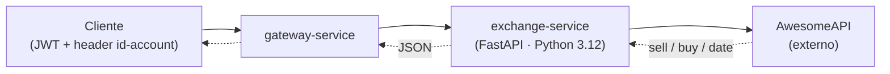

# Exchange API

!!! abstract "Serviço"
    **Responsável:** João Whitaker Citino · **Repositório:** [exchange-service](https://github.com/Plataformas-Micro/exchange-service) · **Linguagem:** Python 3.12 / FastAPI

!!! info "Plataforma poliglota"
    Este é o **único serviço não-Java** da plataforma. Implementado em Python, ele integra uma **API de câmbio de terceiros** (AwesomeAPI) e demonstra que a arquitetura de microsserviços é poliglota: cada serviço pode escolher a stack mais adequada ao seu domínio, contanto que respeite os contratos de comunicação (HTTP/JSON, JWT, header `id-account`).

## Descrição

O **Exchange API** é o serviço de câmbio da plataforma. Ele consulta uma **API de terceiros** ([AwesomeAPI](https://docs.awesomeapi.com.br/)) para obter as **taxas de conversão** entre pares de moedas em tempo real.

É consumido principalmente pelo **order-service**, que o utiliza para **converter o total de um pedido** sob demanda (por exemplo, exibir o valor de uma compra em outra moeda). O serviço é **stateless** — não possui banco de dados nem cache próprio; cada requisição resulta em uma chamada ao provedor externo.

## Arquitetura



O gateway valida o JWT e propaga o header `id-account` para o serviço. O exchange-service apenas orquestra a chamada externa e formata a resposta — toda a lógica de taxa vem da AwesomeAPI.

## Endpoints

| Método | Rota | Auth | Descrição |
|--------|------|:----:|-----------|
| `GET` | `/exchanges/{from}/{to}` | sim | Retorna a taxa de conversão entre duas moedas (200). |
| `GET` | `/exchanges/health-check` | não | Verificação de saúde do serviço (200). |
| `GET` | `/metrics` | não | Métricas Prometheus expostas pelo Instrumentator. |

A rota de conversão exige o header `id-account` (propagado pelo gateway) e devolve a cotação no formato:

```json title="Resposta · GET /exchanges/USD/BRL"
{
  "sell": 0.82,
  "buy": 0.80,
  "date": "2021-09-01 14:23:42",
  "id-account": "0195ae95-...."
}
```

Exemplos de pares de moedas suportados:

| Par | Significado |
|-----|-------------|
| `USD/BRL` | Dólar americano → Real |
| `EUR/BRL` | Euro → Real |
| `USD/EUR` | Dólar americano → Euro |
| `GBP/USD` | Libra esterlina → Dólar americano |
| `BRL/USD` | Real → Dólar americano |

!!! note "Disponibilidade dos pares"
    A lista de pares válidos é definida pela **AwesomeAPI**. Pares inexistentes ou indisponíveis no provedor resultam em **502** (ver seção de Implementação).

## Implementação

Estrutura enxuta do projeto:

```text
exchange-service/
├── main.py          # bootstrap FastAPI + Instrumentator
├── router.py        # rotas /exchanges/...
├── service.py       # chamada à AwesomeAPI
├── model.py         # ExchangeOut (Pydantic)
├── requirements.txt
├── Dockerfile
└── k8s/             # deployment.yaml, service.yaml
```

A rota de conversão recebe as moedas via path e o identificador da conta via header:

```python title="router.py"
@router.get("/exchanges/{from_currency}/{to_currency}", response_model=ExchangeOut)
def exchange(
    from_currency: str,
    to_currency: str,
    id_account: str = Header(alias="id-account"),
):
    return get_exchange(from_currency, to_currency, id_account)
```

A chamada à AwesomeAPI usa `timeout=5` e converte qualquer falha (rede, par inexistente, payload inválido) em **HTTP 502**:

```python title="service.py"
url = f"https://economia.awesomeapi.com.br/json/last/{from_upper}-{to_upper}"
try:
    response = requests.get(url, timeout=5)
    response.raise_for_status()
    data = response.json()[key]
    return ExchangeOut(
        sell=float(data["ask"]),   # ask  → sell (preço de venda)
        buy=float(data["bid"]),    # bid  → buy  (preço de compra)
        date=data["create_date"],
        id_account=id_account,
    )
except (requests.RequestException, KeyError, ValueError) as e:
    raise HTTPException(status_code=502, detail=f"Exchange API error: {str(e)}")
```

O mapeamento de campos espelha a terminologia de mercado da AwesomeAPI:

- **`ask` → `sell`**: preço pelo qual a moeda é **vendida** ao cliente.
- **`bid` → `buy`**: preço pelo qual a moeda é **comprada** do cliente.

!!! warning "Ordem das rotas importa"
    No FastAPI, rotas são avaliadas na ordem de declaração. A rota estática `/exchanges/health-check` **deve ser declarada antes** de `/exchanges/{from}/{to}`; caso contrário, `health-check` seria capturado como um par de moedas pelo path dinâmico.

## Observabilidade

O endpoint **`/metrics`** é exposto automaticamente pelo `prometheus-fastapi-instrumentator` em `main.py`:

```python title="main.py"
Instrumentator().instrument(app).expose(app)
```

O **Prometheus** faz scrape periódico desse endpoint, coletando métricas padrão de requisições HTTP (contagem, latência, status) sem instrumentação manual adicional.

## Stack

| Item | Detalhe |
|------|---------|
| Linguagem | Python 3.12 |
| Framework | FastAPI |
| HTTP client | requests |
| API externa | AwesomeAPI |
| Métricas | prometheus-fastapi-instrumentator |
| Deploy | Docker + EKS |
| Banco de dados | — (serviço stateless) |

## Status

- [x] Conversão de moeda (`GET /exchanges/{from}/{to}`)
- [x] Health-check (`GET /exchanges/health-check`)
- [x] Métricas Prometheus (`GET /metrics`)
- [x] Integração com a AwesomeAPI
- [x] Deploy no EKS (Docker + manifests `k8s/`)
- [x] Rota registrada no gateway

---

**Veja também:** [Arquitetura da plataforma](../arquitetura.md) · [Gargalos e performance](../bottlenecks.md) · [Order API](order.md)
