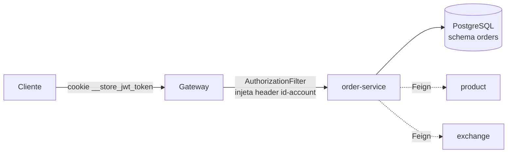
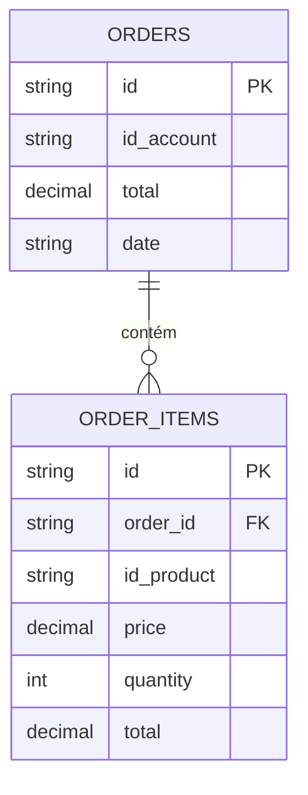

# Order API

!!! abstract "Serviço"
    **Responsável:** Mateus Porto Pereira Paiva · **Repositório:** [order-service](https://github.com/Plataformas-Micro/order-service) · **Linguagem:** Java 25 / Spring Boot 4.0.3

O serviço é distribuído em dois artefatos: uma biblioteca de contratos e a implementação.

| Artefato | Papel |
| --- | --- |
| `order` (lib) | Contratos compartilhados: `OrderController` (Feign), DTOs (`OrderIn`, `OrderOut`, `OrderSummaryOut`). |
| `order-service` (impl) | Implementação REST, persistência (PostgreSQL) e integrações Feign. |

## Descrição

Gerencia pedidos de usuários autenticados. Cada pedido referencia produtos existentes (validados via Product) e registra um **snapshot do preço em USD** no momento da criação. A conversão para outra moeda é **opcional** e calculada sob demanda via Exchange, sem alterar os valores armazenados.

## Arquitetura



O gateway valida o JWT e injeta o header `id-account`, que o serviço usa para escopo de propriedade dos pedidos.

## Endpoints

| Método | Rota | Auth | Descrição |
| --- | --- | --- | --- |
| `POST` | `/orders` | Sim | Cria um pedido (`201`). Retorna `400` se algum produto não existe. |
| `GET` | `/orders` | Sim | Lista resumida dos pedidos do usuário (`200`). |
| `GET` | `/orders/{id}` | Sim | Detalhe do pedido (`200`). `?currency=` converte os totais. `404` se não pertence ao usuário; `422` se a moeda não é suportada. |
| `GET` | `/orders/health-check` | Não | Liveness probe (`200`). |

!!! tip "Parâmetro `currency`"
    O query param `currency` é opcional e o padrão é **USD** (valores armazenados). Quando informado, a cotação é obtida no Exchange e aplicada apenas na resposta; o campo `currency` só aparece quando a conversão é resolvida.

## Exemplos

=== "POST request"

    ```json title="POST /orders"
    {
      "items": [
        { "idProduct": "8f3e...", "quantity": 2 }
      ]
    }
    ```

=== "POST 201"

    ```json title="201 Created (sem campo currency)"
    {
      "id": "a91c...",
      "date": "2025-09-01T12:30:00",
      "items": [
        {
          "id": "d72b...",
          "product": { "id": "8f3e..." },
          "quantity": 2,
          "total": 20.24
        }
      ],
      "total": 26.44
    }
    ```

=== "GET ?currency=BRL"

    ```json title="GET /orders/a91c...?currency=BRL (rate 6.0)"
    {
      "id": "a91c...",
      "date": "2025-09-01T12:30:00",
      "currency": "BRL",
      "items": [
        {
          "id": "d72b...",
          "product": { "id": "8f3e..." },
          "quantity": 2,
          "total": 121.44
        }
      ],
      "total": 158.64
    }
    ```

## Comunicação entre serviços

| Serviço | Protocolo | Propósito |
| --- | --- | --- |
| product | OpenFeign | Validar o produto e obter o preço (snapshot na criação). |
| exchange | OpenFeign | Converter os totais sob demanda na consulta por id. |

!!! note
    `@EnableFeignClients` está restrito aos pacotes `store.product` e `store.exchange`, mantendo o escopo dos clientes Feign apenas nessas integrações.

## Modelo de dados



Os campos `price` e `total` são gravados em **USD** no momento da criação (snapshot), garantindo histórico estável independente de variações de câmbio.

## Stack

| Item | Detalhe |
| --- | --- |
| Linguagem | Java 25 |
| Framework | Spring Boot 4.0.3 |
| Banco | PostgreSQL 17, schema `orders` via Flyway |
| Integrações | OpenFeign (product, exchange) |
| Observabilidade | Actuator + Micrometer/Prometheus em `/orders/actuator` (exposição: `prometheus`) |
| Serialização | Jackson `default-property-inclusion: non_null` |
| Deploy | Docker + AWS EKS |

## Status

- [x] CRUD de pedidos
- [x] Snapshot de preço em USD na criação
- [x] Conversão de moeda on-demand via Exchange
- [x] Endpoint `health-check`
- [x] Métricas Prometheus
- [x] Deploy em EKS
- [x] Rota exposta no gateway

Justificativas técnicas (snapshot de preço, conversão via Feign) em [Bottlenecks](../bottlenecks.md). Veja também a [Arquitetura](../arquitetura.md) e os serviços relacionados [Product](product.md) e [Exchange](exchange.md).
