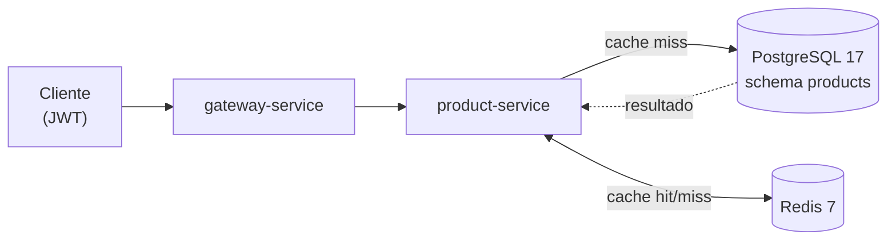

# Product API

!!! abstract "Serviço"
    **Responsável:** João Whitaker Citino · **Repositório:** [product-service](https://github.com/Plataformas-Micro/product-service) · **Linguagem:** Java 25 / Spring Boot 4.0.3

## Descrição

REST API responsável pela gestão de produtos do catálogo. Persiste os dados em **PostgreSQL 17**, utiliza **Redis 7** como cache de leitura e expõe métricas no formato **Prometheus** via Actuator.

O serviço segue o padrão de **contract-library**: a interface pública (Feign + DTOs) vive em um módulo separado da implementação, permitindo que outros serviços consumam o contrato sem depender do código interno.

| Módulo | Papel |
| --- | --- |
| `product` | Biblioteca de contrato: interface Feign (`ProductController`) e DTOs (`ProductIn`, `ProductOut`). |
| `product-service` | Implementação: `ProductResource`, `ProductService`, persistência JPA e cache Redis. |

## Arquitetura



A leitura por `id` consulta primeiro o **Redis**; em caso de _miss_, busca no PostgreSQL e popula o cache. Escritas mantêm o cache consistente (ver [Cache com Redis](#cache-com-redis)).

## Endpoints

| Método | Rota | Auth | Descrição |
| --- | --- | --- | --- |
| `POST` | `/products` | sim | Cria um produto. Retorna **201** + header `Location`. |
| `GET` | `/products` | sim | Lista todos os produtos. **200**. |
| `GET` | `/products/{id}` | sim | Busca por id. **200** ou **404**. |
| `DELETE` | `/products/{id}` | sim | Remove um produto. **204**. |
| `GET` | `/products/health-check` | não | Liveness do serviço. **200**. |

=== "Request"

    ```json
    {
      "name": "Tomato",
      "price": 10.12,
      "unit": "kg"
    }
    ```

=== "Response (201)"

    ```json
    {
      "id": "9f1c8a3e-...",
      "name": "Tomato",
      "price": 10.12,
      "unit": "kg"
    }
    ```

## Cache com Redis

O `ProductService` anota suas operações com as abstrações de cache do Spring, mantendo o Redis sincronizado com o banco:

```java title="ProductService.java"
@CachePut(value = "products", key = "#result.id()")
public Product create(Product product) { ... }

@CacheEvict(value = "products", key = "#id")
public void delete(String id) { ... }

@Cacheable(value = "products", key = "#id")
public Product findById(String id) { ... }
```

A serialização é configurada em `RedisConfig` com `GenericJackson2JsonRedisSerializer`, usando um `ObjectMapper` ajustado para enxergar **campos** (`PropertyAccessor.FIELD`) em vez de getters JavaBean.

!!! warning "Serializer obrigatório"
    Os DTOs e entidades são `record`/Lombok com _fluent accessors_ (ex.: `id()` em vez de `getId()`). O serializer JSON com visibilidade de campo é **necessário** — o serializer padrão (JDK) ou um Jackson baseado em getters não conseguiria reidratar os objetos do cache corretamente.

Detalhes em [Bottlenecks → Caching com Redis](../bottlenecks.md).

## Observabilidade

O Actuator expõe apenas o endpoint **Prometheus**, sob o base-path `/products/actuator`:

```yaml title="application.yaml"
management:
  endpoints:
    web:
      base-path: /products/actuator
      exposure:
        include: ['prometheus']
```

As métricas são coletadas via Micrometer e raspadas pelo Prometheus no cluster (ver [Infra → CI/CD](../infra/cicd.md)).

## Stack

| Item | Detalhe |
| --- | --- |
| Linguagem | Java 25 |
| Framework | Spring Boot 4.0.3 |
| Banco | PostgreSQL 17 (schema `products`, migrações Flyway) |
| Cache | Redis 7 (TTL 300s, `cache-null-values: false`) |
| Métricas | Actuator + Micrometer / Prometheus |
| Build | Maven |
| Deploy | Docker + EKS |

## Status

- ✅ CRUD completo (`create`, `findAll`, `findById`, `delete`)
- ✅ Cache de leitura com Redis (`@Cacheable` / `@CachePut` / `@CacheEvict`)
- ✅ Health-check público (`/products/health-check`)
- ✅ Métricas Prometheus via Actuator
- ✅ Deploy no EKS
- ✅ Rota registrada no gateway

---

**Serviços relacionados:** [Exchange API](exchange.md) · [Order API](order.md) · [Arquitetura geral](../arquitetura.md)
